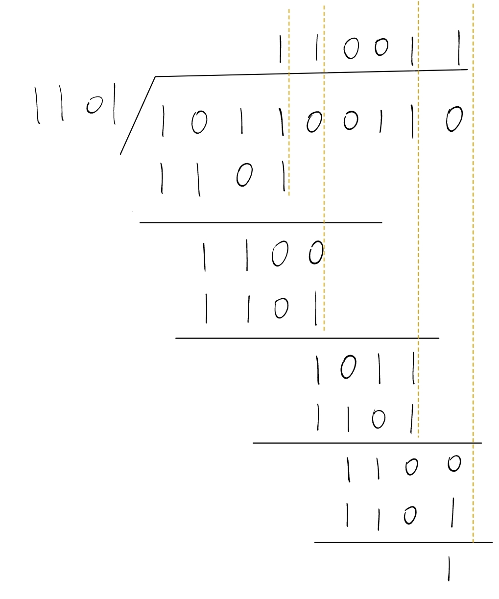

模2除法用于 CRC循环冗余校验码的计算。

# 计算

模2除法不同于正常的除法运算，模2除法将操作时的减法操作换为了 异或操作。

通过一个例子来引入，下图为模2除法的计算过程。

可以发现，计算过程中，我在每个商为 1 的位置后面都添加了一条线。

这条线对应的下方的式子，左侧长度都一致，而没有添加黄线的位置商的结果都为 0。

首先，可以确定的是除数的最高位一定是 $1$。

在正常的除法运算中，计算过程中，需要不断地将高位的数减为 $0$，而在这里，由于计算过程中使用 **异或** 替代了减法，那么如果想要将高位数字变成 0，就要将除数的最高位的 $1$ 与被除数的 $1$ 对齐，异或后才能归 $0$。

所以，在计算过程中，将除数的最高位的 $1$ 对其被除数最高位的 $1$，当被除数的当前最高位为 $1$ 时，商记为 $1$，并将除数与该位对齐的部分进行异或运算；若当前最高位为 $0$，则商为 $0$，且不进行异或运算，直接看下一位，将下一位拉下，重复以上步骤，直至被除数的所有位都处理完。