# 计算机基础知识

## 数据的表示

### 进制转换

|    进制     |          数码           | 基数  |    位权    |
| :-------: | :-------------------: | :-: | :------: |
| 十进制(`D`)  | $0,1,2,3,4,5,6,7,8,9$ | 10  | $10^{k}$ |
| 二进制(`B`)  |         $0,1$         |  2  | $2^{k}$  |
| 八进制(`O`)  |   $0,1,2,3,4,5,6,7$   |  8  | $8^{k}$  |
| 十六进制(`H`) |   $0~9,A,B,C,D,E,F$   | 16  | $16^{k}$ |

#### 加权法/按权展开法

$R$ 进制转十进制使用 **按权展开法**。

每一位的数和当前位的权值相乘后的结果累加起来。

**注:** 小数点左边的位权阶数 $k$ 从 $0$ 开始，右边的位权阶数 $k$ 从 $-1$ 开始。
	例如: $10.1B = 2^1 \times 1 + 2^{0} \times 0 + 2^{-1} \times 1 = 2.5D$

#### 短除法

十进制转 $R$ 进制使用 **短除法**。

循环除 $R$，直到商为 $0$，从下往上取余数。

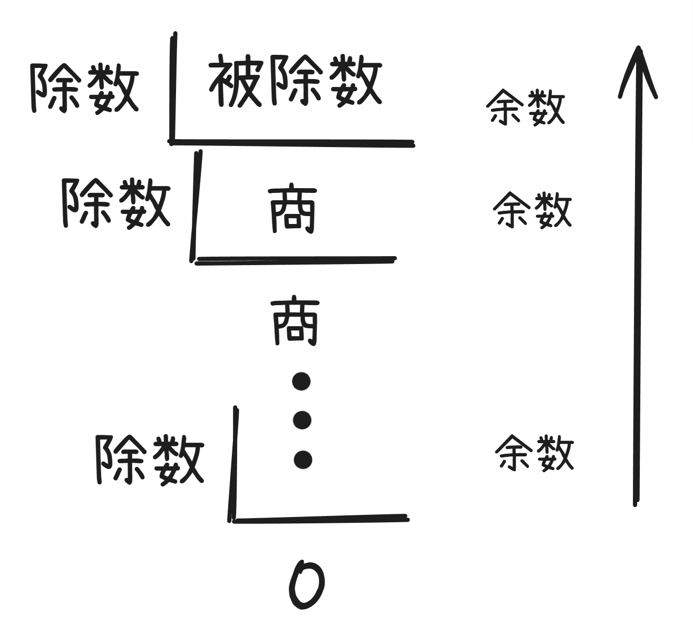

例如: $9D = 101B$

### 码制

- **源码**: 最高位是符号位，其余表示数值的绝对值。
  符号位: $0$ 表示正数，$1$ 表示负数。
- **反码**: 
  - 正数: 反码与原码相同。
  - 负数: 符号位不变，其余位取反。
- **补码**:
  - 正数: 反码与原码相同。
  - 负数: 反码的基础上 $+1$ (符号位参与计算)。
- **移码**: 无论正负，把 *补码* 符号位取反。

|     |   数值 +1   |   数值 -1   | (+1) + (-1) |
| :-: | :-------: | :-------: | :---------: |
| 原码  | 0000 0001 | 1000 0001 |  1000 0010  |
| 反码  | 0000 0001 | 1111 1110 |  1111 1111  |
| 补码  | 0000 0001 | 1111 1111 |  0000 0000  |
| 移码  | 1000 0001 | 0111 1111 |  1000 0000  |

通过 $(+1) + (-1)$ 可以看出，原码并不适合算术运算，于是出现了反码。

将反码的结果转换为原码后，表示的十进制为 $-0$，于是出现了补码。

将补码的结果转换为 十进制 后，结果为 $+0$。

计算机中长用 **补码** 进行 **算术运算**。

而 **移码** 一般用做 **浮点数** 的算术运算。

**注**: 补码和移码中，$\pm 0$ 编码相同。

#### 二进制的数值范围与数码个数

##### 定点整数

| 码制  |                 定点整数                 |    数码个数     |
| :-: | :----------------------------------: | :---------: |
| 原码  | $-(2^{n-1}-1) \sim +(2^{n - 1} - 1)$ | $2^{n} - 1$ |
| 反码  | $-(2^{n-1}-1) \sim +(2^{n - 1} - 1)$ | $2^{n} - 1$ |
| 补码  |   $-2^{n-1} \sim +(2^{n - 1} - 1)$   |   $2^{n}$   |
| 移码  |   $-2^{n-1} \sim +(2^{n - 1} - 1)$   |   $2^{n}$   |

**注**: 补码和移码可以取到 $-2^{n - 1}$。

例如:

| 原码  | 真值  |
| :-: | :-: |
| 000 | +0  |
| 001 | +1  |
| 010 | +2  |
| 011 | +3  |
| 100 | -0  |
| 101 | -1  |
| 110 | -2  |
| 111 | -3  |

| 补码  | 真值  |
| :-: | :-: |
| 000 | +0  |
| 001 | +1  |
| 010 | +2  |
| 011 | +3  |
| 100 | -4  |
| 101 | -3  |
| 110 | -2  |
| 111 | -1  |

在补码中，$111B$ 各位对应的真值为 $-4,2,1$。

补码 $100B$ 对应了 $-4$，但却无对应的原码。

##### 定点小数

| 码制  |                   定点小数                   |    数码个数     |
| :-: | :--------------------------------------: | :---------: |
| 原码  | $-(1-2^{-(n-1)}) \sim +(1 - 2^{-(n-1)})$ | $2^{n} - 1$ |
| 反码  | $-(1-2^{-(n-1)}) \sim +(1 - 2^{-(n-1)})$ | $2^{n} - 1$ |
| 补码  |     $-1.0 \sim +(1 - 2^{-(n - 1)})$      |   $2^{n}$   |
| 移码  |     $-1.0 \sim +(1 - 2^{-(n - 1)})$      |   $2^{n}$   |

例如: 4个数位时

$1111B$，最高位为符号位，$-(2^{-1} + 2^{-2} + 2^{-3})$

$1111B$ 也可以写作 $-0.111B$，$-0.111B +(-0.001B) = -1B$ 所以 $-0.111B = -1B + 0.001B = -(1B - 0.001B) = -(1 - 2^{-3})$ 

#### 例题

> 如果 "2X" 的补码是 "90H"，那么 X 的真值是()。

`H` 表示十六进制，由于需要转换为 原码，所以需要先转换为 二进制。

$90H = 10010000B$

补码转原码: 结果为 $11110000B = -(16+32+64) = -112$

设 "2X" 为 十 进制，所以 $2X = -112$，$X = -56$

故，X 的真值是 $-56$。

---

> 采用 n 位补码(包含一个符号位)表示数据，可以直接表示数值()。
> A. $2^{n}$
> B. $-2^{n}$
> C. $2^{n - 1}$
> D. $-2^{n - 1}$

根据补码的取值范围为 $-2^{n - 1} \sim 2^{n - 1} - 1$ 可以的出，选 $D$。

### 浮点数的表示

$N = \text{尾数} \times \text{基数}^{\text{指数或阶码}}$

#### 运算过程

**对阶 > 尾数计算 > 结果格式化**

例如:
$$
\begin{split}
	& \;\;\;\;\; 1.23 \times 2^{2} + 3.2 \times 2^{4} \\ 
	&= 0.0123 \times 2^{4} +  3.2 \times 2^{4} \\
	&= 3.2123 \times 2^{4}
\end{split}
$$

1. 对阶时，小数向大数看齐
2. 对阶时通过较小数的尾数右移实现的
3. 阶码的尾数决定数的表示范围，阶码的位数越多范围越大
4. 尾数的尾数决定数的有效精度，尾数的位数越多精度越高

#### 例题

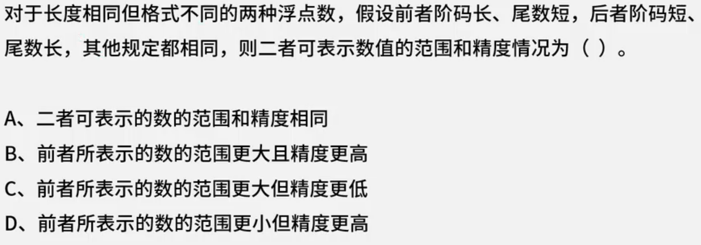

根据，阶码越长，表示范围越大，尾数越长，精度越高来判断，

前者的范围更大，精度更低。

后者的范围更小，精度更高。

所以答案为 $C$。

---

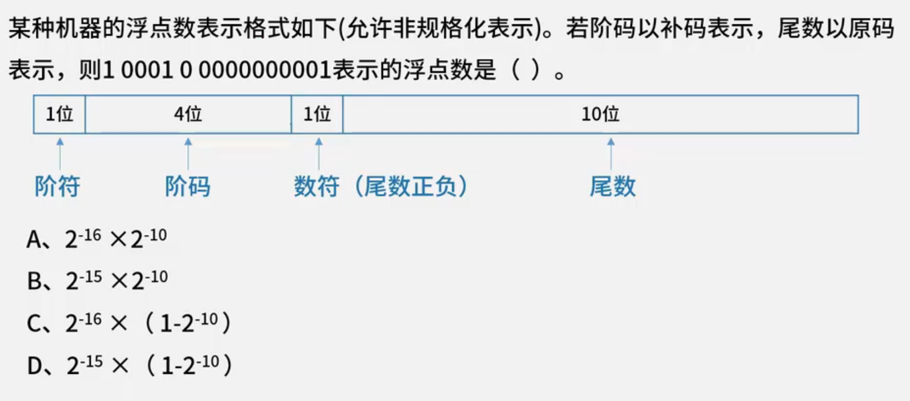

首先回顾浮点数的表示方法: $N = \text{尾数} \times \text{基数}^{\text{阶码}}$

将题目中的二进制拆分为两部分: 阶码 `1 0001` 与 尾数 `0 0000000001`

其中，阶码为补码，转换为源码得到 `1 1111`，所以阶码就为 $-15$。

尾数为原码，而尾数表示浮点数，则可转换为 $0.0000000001$ 即 $2^{-10}$。

虽然题目没有明说基数，但大概率为 $2$。

综上，答案就为 $2^{-10} \times 2^{-15}$，选择 B。

### 算术逻辑运算

逻辑变量间的运算称为逻辑运算。

- 与(&&, AND)
- 或(||, OR)
- 非(!, NOT)
- 异或($\oplus$, XOR)

优先次序: ! > && > $\oplus$ > ||

#### 短路原则

在逻辑表达式的求解中，并不是所有的逻辑运算符都要执行。

1. a && b 只有 a 为真时，才需要判断 b 的值。
2. a || b 只要 a 为真，就不必判断 b 的值，只有 a 为假，才判断 b。

#### 例题

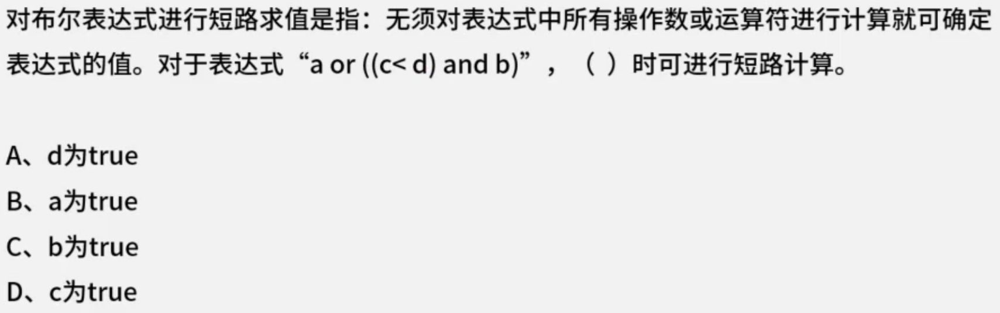

a 为 true 就无需进行后面的计算，故选择 $B$。

## 校验码

### 奇偶校验码

编码方式: 由若干位有效信息(如一个字节)，再加上一个二进制(校验位)组成校验码。

**奇校验**: 整个校验码(有效信息位和校验位)中 "1" 的个数为奇数，可检验奇数位错误，不可纠错。

**偶校验**: 整个校验码(有效信息位和校验位)中 "1" 的个数为偶数，可检验偶数位错误，不可纠正错误。

### CRC循环冗余校验码

CRC循环冗余校验码可以检验 **任意位** 数据错误，无法纠错。

编码方式: 
- 发送方 把 **k位信息位** 对 **生成多项式$G(X)$** 经过循环 [模2除法](模2除法.md) 得到 **r 位校验位** ($r$ 为 $G(X)$ 最高次项的次数，长度不足，在前补 $0$)
  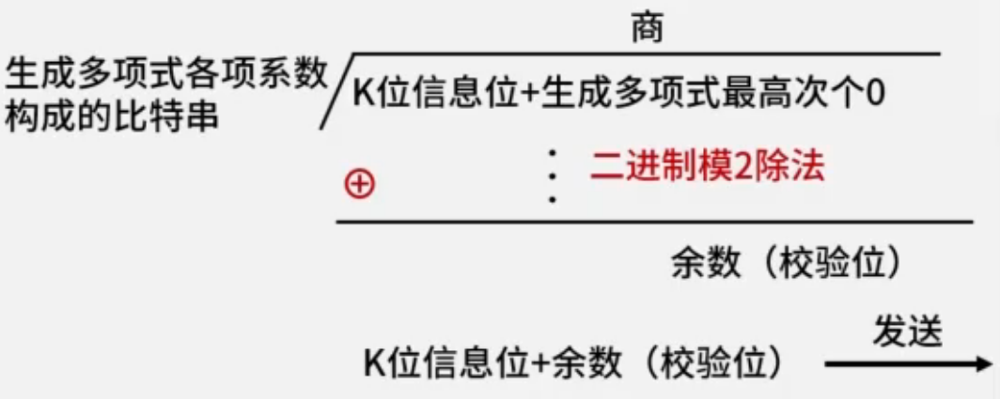
- 接收方 拿到校验码后，对 **生成多项式 $G(X)$** 经过循环 [模2除法](模2除法.md)，结果为 $0$ 则数据无误。否则，只要有 *任意个* 数据为错误，结果都不为 $0$。
  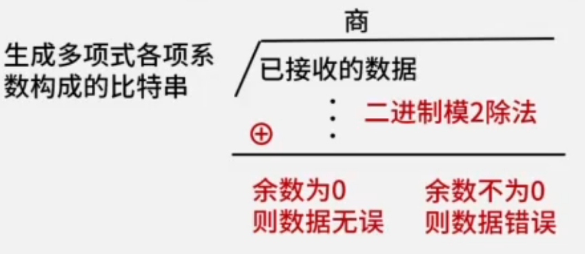

### 海明校验码

海明校验码可以检验并修复数据错误($1$ 位)。

编码方式: 在有效信息位中加入几个校验位形成海明码，使码据比较均匀地拉大，并把海明码的么个二进制位分配到几个奇偶教研组中。

海明码 **校验位的数量** 公式: $2^{r} \ge m + r + 1 \;(r \in \mathbb{N})$。 $r$ 是校验位数量(最小的满足公式的自然数), $m$ 是信息位数量。

校验位放置位置: $2^{0}, 2^{1}, 2^{2}, \cdots, 2^{r - 1}$

例如: 求信息位 $1011$ 的海明码。

根据 **校验位的数量** 计算公式: $2^{r} \ge m + r + 1$

1. 列出校验位的的位置

从 $0$ 开始带入公式，计算出最小的满足公式的答案为 $r = 3$。

所以信息位分别放在 $2^{0} \to 1, \; 2^{1} \to 2,\; 2^{2} \to 4$。

2. 列出校验位计算公式

|    7    |    6    |    5    |    4    |     3     |    2    |    1    | 位数  |
| :-----: | :-----: | :-----: | :-----: | :-------: | :-----: | :-----: | :-: |
| $l_{4}$ | $l_{3}$ | $l_{2}$ |         | ${l_{1}}$ |         |         | 信息位 |
|         |         |         | $r_{2}$ |           | $r_{1}$ | $r_{0}$ | 校验位 |

根据前面算出的校验位的位置，列出所有信息位的位置。

$$l_{4} \to 7 \to 111$$
$$l_{3} \to 6 \to 110$$
$$l_{2} \to 5 \to 101$$
$$l_{1} \to 3 \to 011$$

根据二进制每位是否为 $0$，确定校验位的计算公式

$$r_{0} = l_{4} \oplus l_{2} \oplus l_{1}$$
$$r_{1} = l_{4} \oplus l_{3} \oplus l_{1}$$
$$r_{2} = l_{4} \oplus l_{3} \oplus l_{2}$$

3. 计算校验位的值

根据题目得到 $l_{4} = 1, l_{3} = 0, l_{2} = 1, l_{1} = 1$

所以 $r_{0} = 1, r_{1} = 0, r_{2} = 0$。

4. 将数据加入表格

|  7  |  6  |  5  |  4  |   3   |  2  |  1  | 位数  |
| :-: | :-: | :-: | :-: | :---: | :-: | :-: | :-: |
| $1$ | $0$ | $1$ |     | ${1}$ |     |     | 信息位 |
|     |     |     | $0$ |       | $0$ | $1$ | 校验位 |

所以，该海明码为 $1010101$。

#### 校验方法

接收方将拿到这串数据，假设这串数据仅发生了 $1$ 位错误，得到了错误数据 $1010001$

接下来将这串数据重新计算校验位的数据，得到新的一串校验位 $010$，将拿到的数据中的校验位提取出 两个数据进行 **异或运算**。

$010 \oplus 001 = 011 \to 3$ 代表 $3$ 号位置发生了错误，将 $3$ 号位置进行翻转操作，就可以得到正确的数据 $1010101$，也就完成了数据纠正。

> **海明校验码** 仅能准确发现并修正 $1$ 位数据错误，当有 更多的数据错误时，可能会产生误报，或将引入更多错误。
> 
> 以上面得到的一串海明码 $1010101$ 为例，当发生了两位数据错误时，假设错误数据为 $1000001$ 时，当前校验码为 $001$，通过计算得到的 校验码为 $111$，$001 \oplus 111 = 110 \to 6$。
> 
> 得出了错误位是第 $6$ 位的错误结果，当进行修正后数据就变成了 $1100001$，其中信息位为 $1100$ 而正确的信息位为 $1011$。
> 
> 于是便出现了 [扩展海明校验码](扩展海明校验码)，其可以 **修正一位错误，发现两位错误**。
> 
> 当有更多错误，就需要使用其他方案。

### 总结

|           |         校验码位数         |  校验码位置   |     检错      |  纠错  |                    校验方法                     |
| :-------: | :-------------------: | :------: | :---------: | :--: | :-----------------------------------------: |
|   奇偶校验    |           1           | 一般拼接在头部  | 可检 **奇数个错** | 不可记错 | 奇校验: 最终 $1$ 的个数是奇数个。 偶校验:最终 $1$ 的个数是偶数个。 |
| CRC循环冗余校验 |      生成多项式最高次幂决定      | 拼接在信息位尾部 |     可检错     | 不可纠错 |           [模二除法](模二除法)求余数，拼接为校验码            |
|   海明校验码   | $2^{r} \ge m + r + 1$ | 插在信息位中间  |     可检错     | 可纠错  |                   分组奇偶校验                    |

### 例题

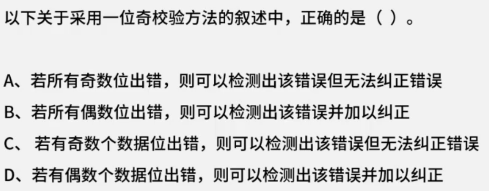

奇校验可以检测出奇数个数位错误，无法纠正错误。

答案选 $C$。

---

> 假设数据位是 $10110011$，生成多项式 $G(x) = x^{4} + x^{3} + 1$，计算余数。

$$
\begin{split}
	G(x) &= x^{4} + x^{3} + 1 \\
	&= 1 \times x^{4} + 1 \times x^{3} + 0 \times x^{2} + 0 \times x^{1} + 1 \times x^{0}
\end{split}
$$

根据题目得到，生成多项式 $G(x)$ 的最高次为 $4$，其系数构成的比特串为 $11001$。

所以，被除数为 $101100110000$，除数为 $11001$，对其进行 [模2除法](模2除法.md)。

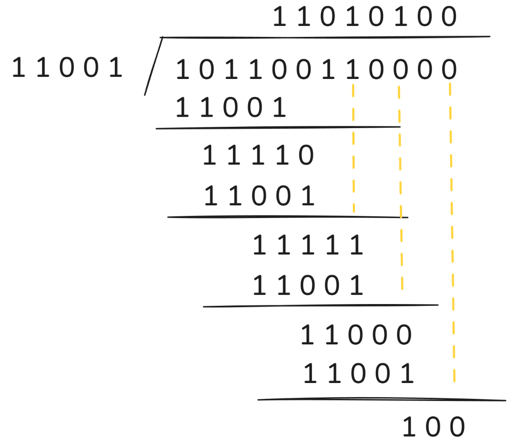

计算出余数为 $100$，同时由于余数要与 $G(x)$ 最高次项的次数相同，不足需补在前补 $0$，由于其最高次项次数为 $4$，所以最终的答案为 $0100$。

---

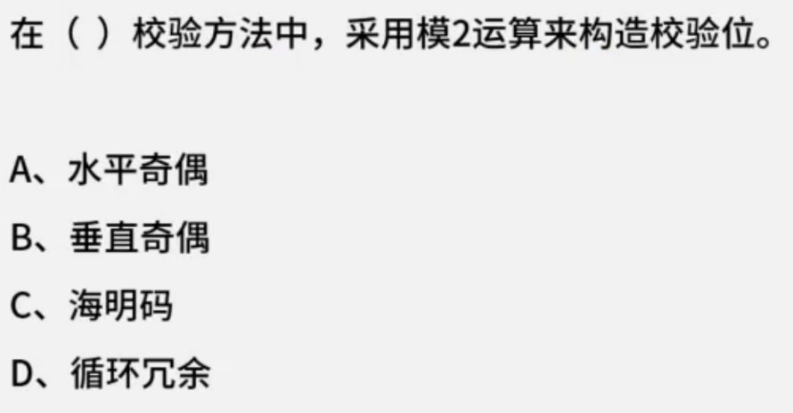

A 和 B 选项并不存在该校验码，C 选项并不使用 模2除法，D 选项CRC循环冗余校验码 使用 [模2除法](模2除法.md) 来构造校验位。

所以答案选择 $D$。

---

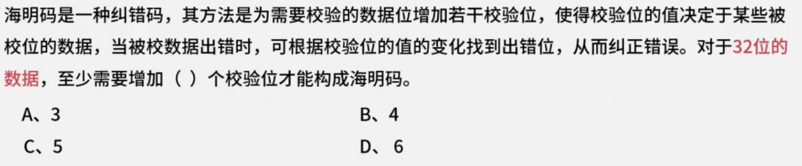

根据海明码的校验位计算公式: $2^{r} \ge m + r + 1(r \in \mathbb{N})$

由于 $m = 32$，所以将 $r = 0, 1, 2, \cdots$ 逐个尝试，最小的满足公式的 $r = 6$。

所以答案 $D$。

---

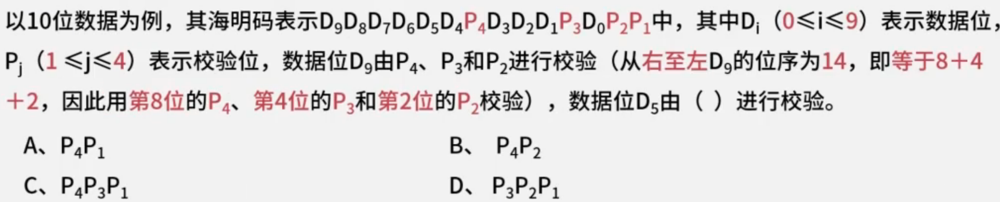

$D_{5}$ 位于第 $10$ 位，$10 = 8 + 2$，使用第 $8$ 位的 $P_{4}$ 和第 $2$ 位的 $P_{2}$。

所以答案 $B$。

# 计算机组成

## CPU的组成

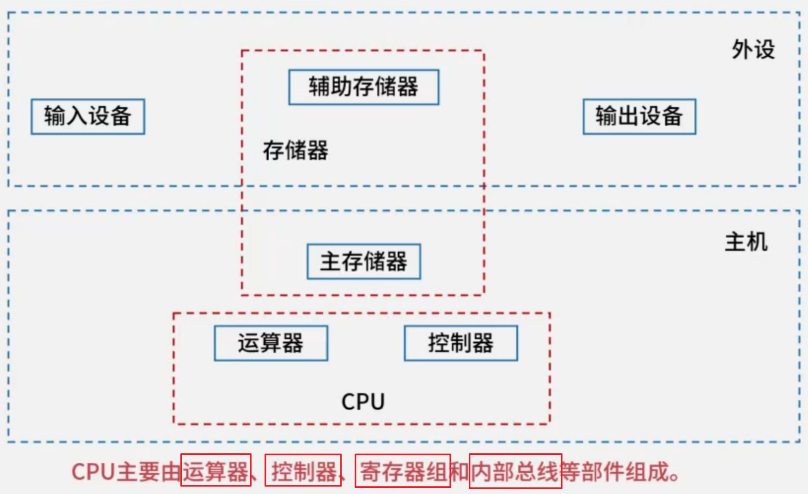

### 运算器

- ***算术逻辑单元***(Arithmetic Logic Unit, **ALU**): 数据的算术运算和逻辑运算。
  ALU 是运算器的核心部件。
- ***累加寄存器***(Accumulator, **AC**): 通用寄存器的一种，为 ALU 提供一个工作区，用于暂存操作数和运算结果。
  ALU 运算时通常默认使用 AC。
- ***数据寄存器/数据缓冲寄存器***(Data Register, **DR**): CPU 与 内存/外设 之间的数据中转站。
- ***状态条件寄存器***(Program Status Word, **PSW**): 存储状态标志 与 控制标志。
  状态标志: 进位 C、零 Z、符号 S、溢出 V、奇偶 P等。
  控制标志: 中断允许、方向、单步等。
  PSW 属于运算器部分，但会影响 控制器 和 程序执行。

### 控制器

- ***程序计数器/指令计数器***(Program Counter, **PC**): 存储 **下一条** 要执行指令的地址。
  PC 存储下一条要执行的地址，每执行一条指令，PC 就增加一个量，为了立刻获取下一条命令的地址，这个量通常是指令所含的字节数。
  由于大多数指令都是按顺序来执行，所以通常只是简单的*对 PC 加 1*。
- ***指令寄存器***(Instruction Register, **IR**): 存储正在执行或正在译码的指令。
- ***指令译码器***(Instruction Decoder, **ID**): 对 IR 中的操作码进行分析解释，并*产生相应的控制信号*。
- ***地址寄存器***(Address Register, **AR**): 保存 **当前** CPU 访问内存单元的地址，用于地址总线。
- ***时序部件***(Timing Unit): 提供时序控制信号，如时钟脉冲、节拍电位、节拍脉冲，协调各部件按节拍工作。
- ***控制单元/微操作信号发生器***(Control Unit, **CU**): 发出具体控制信号。

### 工作过程

1. **取指**: PC -> AR -> 内存; 读出指令 -> DR -> IR; PC 自动加 1。
2. **译码**: IR -> ID; ID 分析操作码，把结果送给 CU。
3. **发令**: CU 结合时序信号 和 PSW 状态，产生微操作控制信号。
4. **执行**: 各部件按微命令动作，完成 运算、传送、写回等。
5. **检查中断**: 如有中断请求，转入中断处理。

### 例题

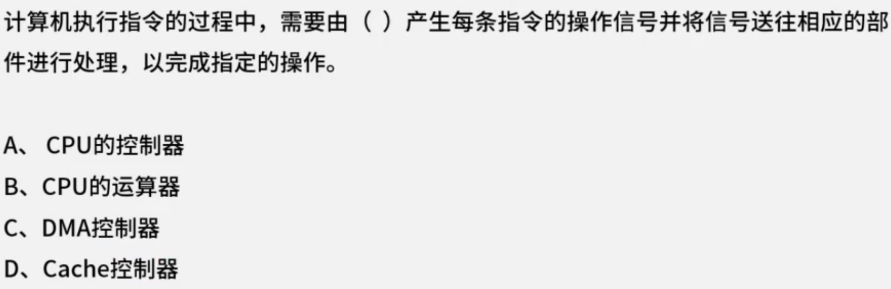

产生每条指令的操作 **信号** 由 CPU 的控制器产生。

答案选 $A$。

## 存储系统

### 层次化存储体系

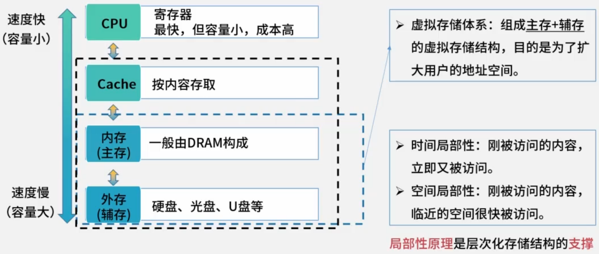

#### 分类

**存储位置**: 内存、外存。

**存取方式**:
1. 按内容存取: 相联存储器(Cache)
2. 按地址存取:
   - 随机存取存储器(内存)
   - 顺序存取存储器(磁带)
   - 直接存取存储器(磁盘)，介于随机和顺序之间。

**工作方式**:
1. 随机存取存储器 RAM
   - 动态随机存取存储器 DRAM: 需要定时刷新，集成度高，成本低。(内存)
   - 静态随机存取存储器 SRAM: 不需要刷新，集成度低，成本高。(Cache)
2. 只读存储器 ROM (如BIOS)
   -    电可擦可编程只读存储器 EEPROM: 以 bit 为单位，更灵活。
   - 闪存 Flash: 以块为单位，更快速。

### Cache

在计算机的存储系统体系中，Cache 是访问速度最快的层次(若有寄存器，则寄存器最快)。

访问速度 快->慢: 寄存器 > Cache > 主存 > 外存

#### 访问命中率

假设 $h$ 代表 Cache 的 **访问命中率**，则 $h = \frac{\text{命中次数}}{\text{总访问次数}}$。

$t_{1}$ 表示 Cache 的周期时间，$t_{2}$ 表示主存储器周期时间。

以读操作为例，设 $t_{3}$ 使用 "Cache+主存储器" 的系统的平均周期，则:
$$
t_{3} = h \times t_{1} + (1 - h) \times t_{2}
$$

其中 $1 - h$ 又称为 **失效率**(未命中率)。

#### 地址映射方式

地址映射时将主存与 Cache 的存储空间划分为若干大小相同的页\块。

##### 直接相联映射(根据编号直接映射)

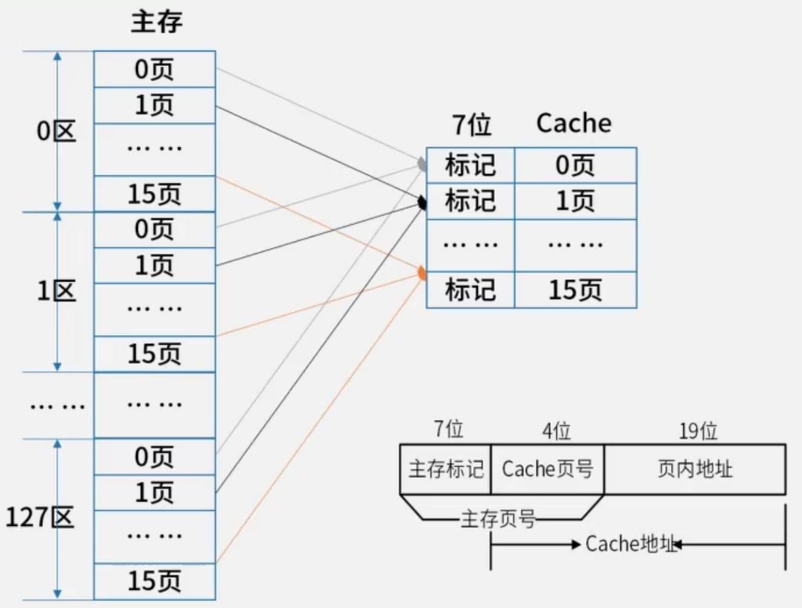

将主存划分为不同的**区**，区中划分多个**页**。

Cache 中划分多个页。

Cache 中的页只能存储 主存中相同编号页的数据。

如: Cache 的 0 页，只能放 $x$ 区 0 页($x \in [0, 127]$) 的数据，不能放任意区的 其他页的数据。

##### 全相联映射(任意映射)

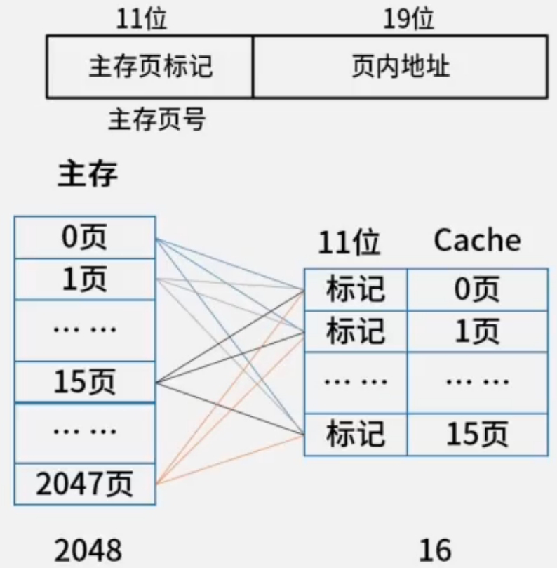

主存 和 Cache 仅划分页。

主存 与 Cache 随意对应。

##### 组相联映射

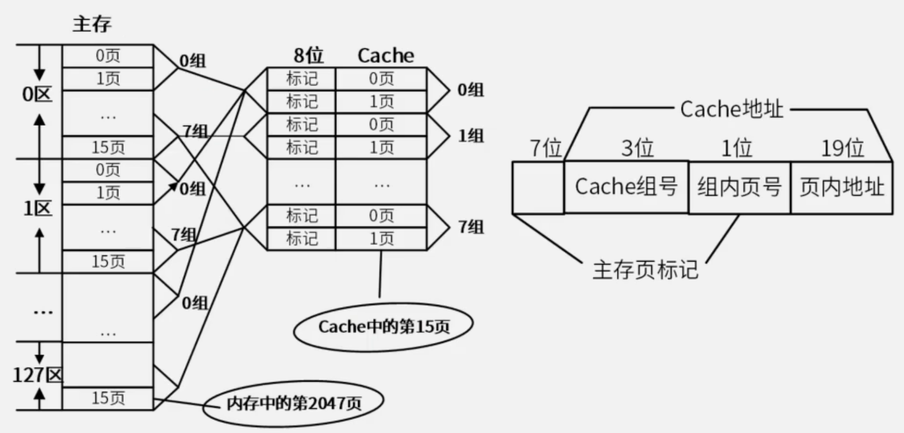

主存 分区，每个区中分页，再对多个该分区的内的页进行分组。

Cache 进行分页，后对多个页进行分组。

组与组间进行 直接相联映射，组中的页进行全相联映射。

##### 优缺点对比

| 地址映射方式 | 冲突率 | 电路复杂度 |     其他     |
| :----: | :-: | :---: | :--------: |
| 直接相联映射 |  高  |  简单   | 对影位置有数据即冲突 |
| 全相联映射  |  低  |  复杂   | 所有位置有数据即冲突 |
| 组相联映射  |  中  |  折中   |            |

### 主存编制

- **存储单元**
  存储单元个数 = 最大地址 - 最小地址 + 1
- **编址内容**(存储单元的大小、位数)
  按 **字** 编址: 存储体的存储单元是 *字存储单元*，即最小寻址单位是一个 字。
  按 **字节** 编址: 存储体的存储单元是 *字节存储单元*，即最小寻址单位是一个 字节。

总容量 = 存储单元个数 $\times$ 编址内容

根据 存储器所要求的容量 和 选定的存储芯片的容量，就可以算出所需芯片的总数，即:

总数量 = 总容量 $\div$ 每片的容量

### 例题

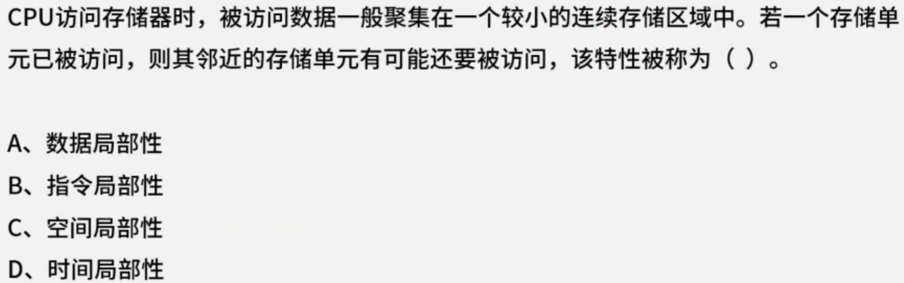

局部性原理包括 *时间局部性* 和 *空间局部性*。

时间局部性: 刚被访问过的内容，立即又被访问。

空间局部性: 刚被访问过的内容，临近的空间很快被访问。

答案选 $C$。

---

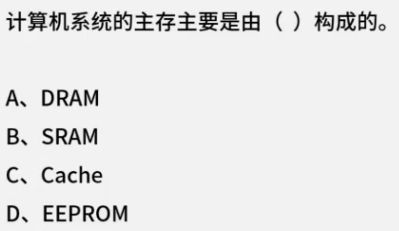

主存一般指内存，内存为 DRAM 动态随机存取存储器。

答案选 $A$。

---

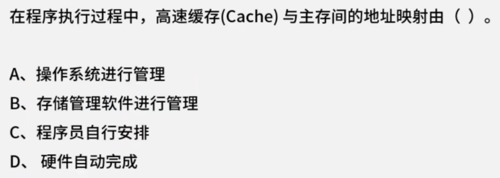

Cache 与 主存间的地址映射由 硬件自动完成。

答案选 $D$。

---

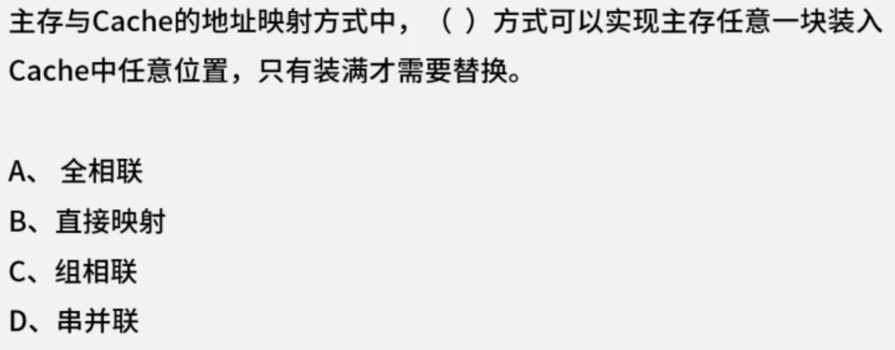

全相联 就是任意映射，当所有位置都装满时，才需要替换某个位置。

答案选 $A$。

---

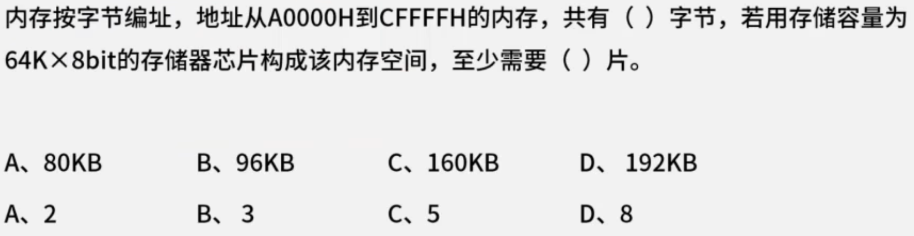

根据存储单元个数的计算公式:

存储单元个数 = 最大地址 - 最小地址 + 1

所以，$CFFFFH - A0000H + 1 = 2FFFFH + 1 = 30000H$

将其转换为 十进制，$30000H = 3 \times 16^{4}$

由于内存按字节编址，所以每个地址表示一个 字节。

所以共 $\frac{3 \times 16^{4}}{1024} B = \frac{3 \times 2^{16}}{2^{10}} B = 3 \times 2^{6} KB = 3 \times 64 KB = 192 KB$ 字节。

存储器芯片的容量为 $64K \times 8bit \to 64 KB$。

所以需要 $\frac{192KB}{64KB} = 3$ 片 存储器芯片。

答案选 $D,B$。

**注**: $1B = 8bit$