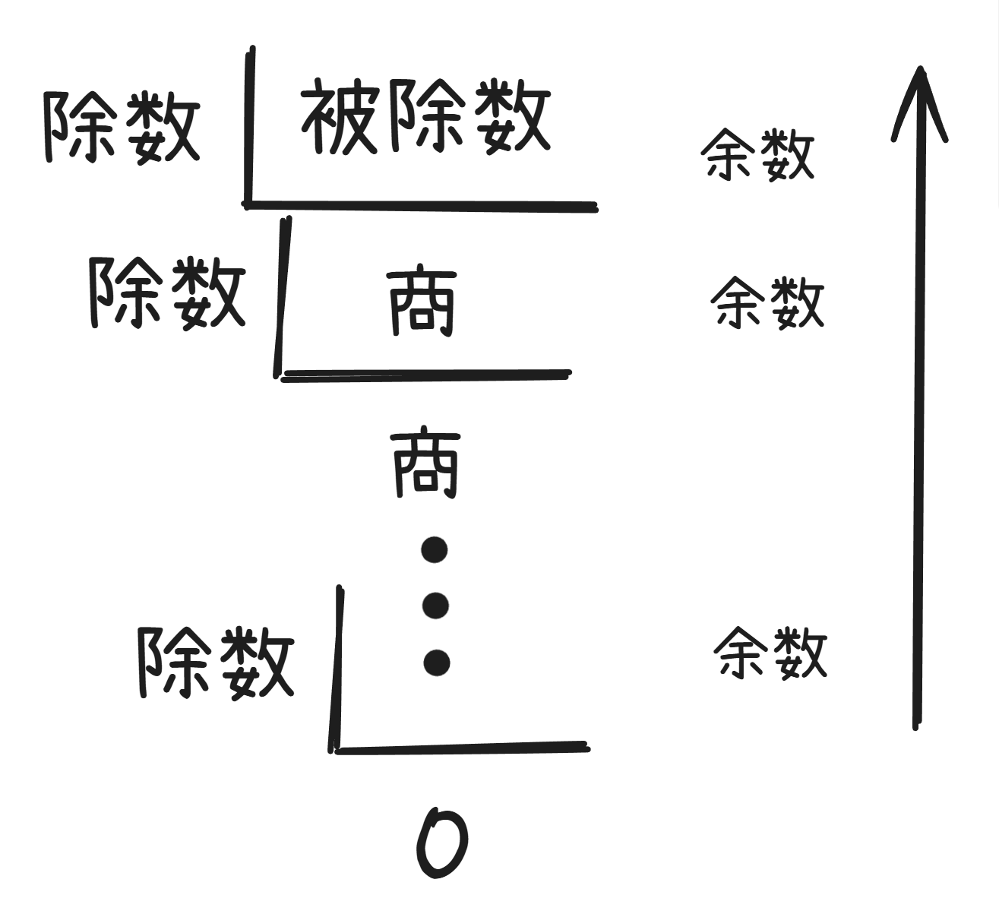
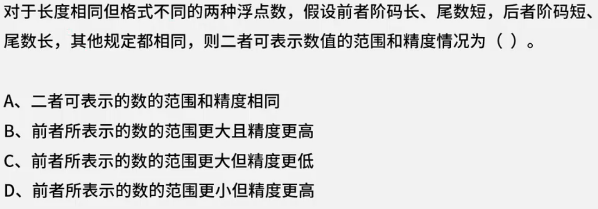
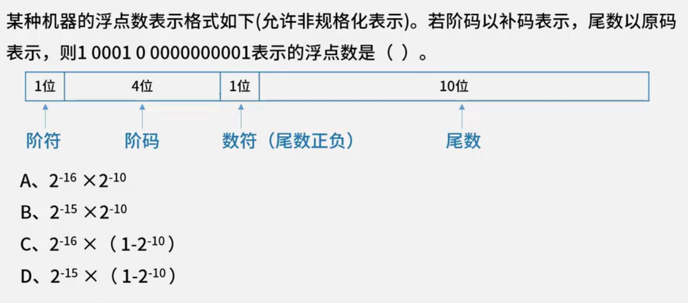
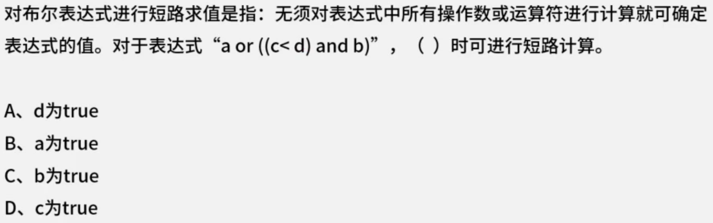
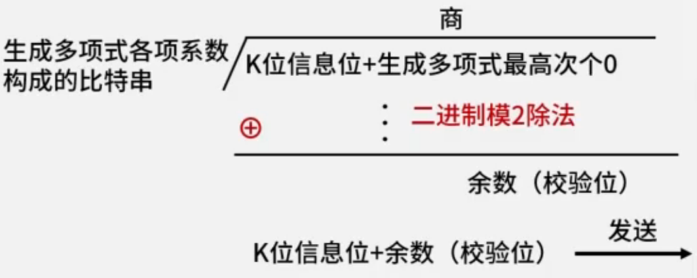
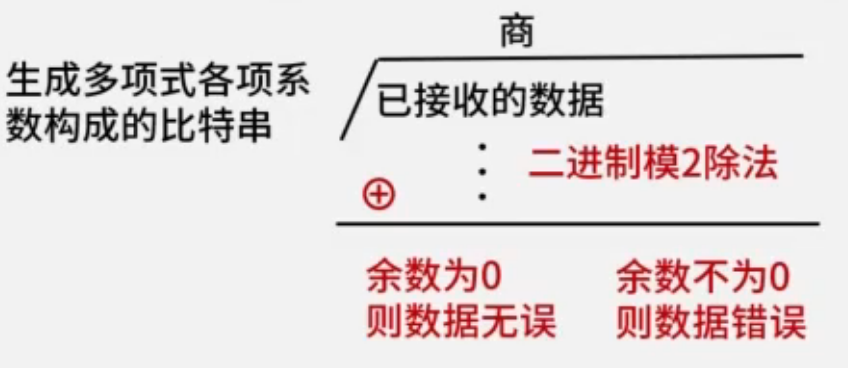
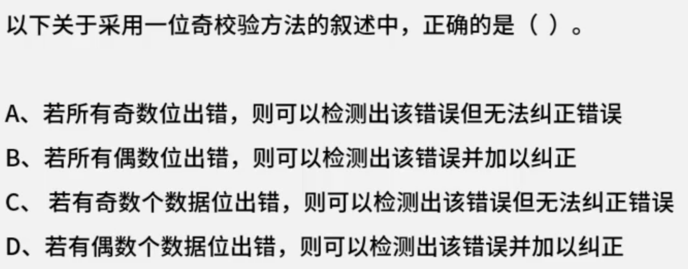
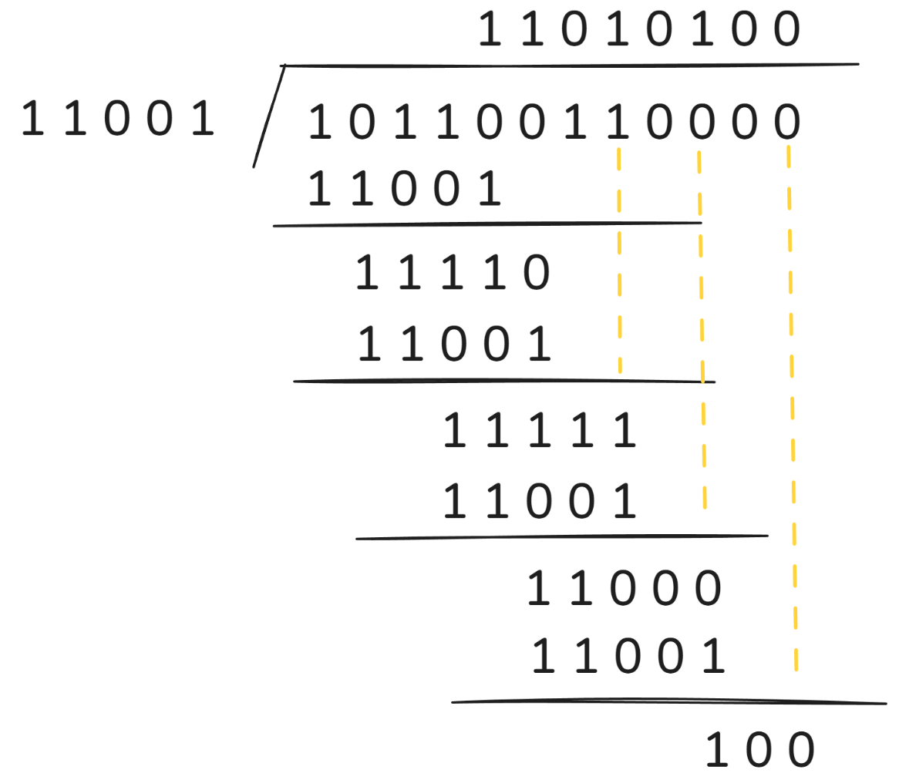

# 计算机组成与体系结构

## 数据的表示

### 进制转换

|    进制     |          数码           | 基数  |    位权    |
| :-------: | :-------------------: | :-: | :------: |
| 十进制(`D`)  | $0,1,2,3,4,5,6,7,8,9$ | 10  | $10^{k}$ |
| 二进制(`B`)  |         $0,1$         |  2  | $2^{k}$  |
| 八进制(`O`)  |   $0,1,2,3,4,5,6,7$   |  8  | $8^{k}$  |
| 十六进制(`H`) |   $0~9,A,B,C,D,E,F$   | 16  | $16^{k}$ |

#### 加权法/按权展开法

$R$ 进制转十进制使用 **按权展开法**。

每一位的数和当前位的权值相乘后的结果累加起来。

**注:** 小数点左边的位权阶数 $k$ 从 $0$ 开始，右边的位权阶数 $k$ 从 $-1$ 开始。
	例如: $10.1B = 2^1 \times 1 + 2^{0} \times 0 + 2^{-1} \times 1 = 2.5D$

#### 短除法

十进制转 $R$ 进制使用 **短除法**。

循环除 $R$，直到商为 $0$，从下往上取余数。

例如: $9D = 101B$

### 码制

- **源码**: 最高位是符号位，其余表示数值的绝对值。
  符号位: $0$ 表示正数，$1$ 表示负数。
- **反码**: 
  - 正数: 反码与原码相同。
  - 负数: 符号位不变，其余位取反。
- **补码**:
  - 正数: 反码与原码相同。
  - 负数: 反码的基础上 $+1$ (符号位参与计算)。
- **移码**: 无论正负，把 *补码* 符号位取反。

|     |   数值 +1   |   数值 -1   | (+1) + (-1) |
| :-: | :-------: | :-------: | :---------: |
| 原码  | 0000 0001 | 1000 0001 |  1000 0010  |
| 反码  | 0000 0001 | 1111 1110 |  1111 1111  |
| 补码  | 0000 0001 | 1111 1111 |  0000 0000  |
| 移码  | 1000 0001 | 0111 1111 |  1000 0000  |

通过 $(+1) + (-1)$ 可以看出，原码并不适合算术运算，于是出现了反码。

将反码的结果转换为原码后，表示的十进制为 $-0$，于是出现了补码。

将补码的结果转换为 十进制 后，结果为 $+0$。

计算机中长用 **补码** 进行 **算术运算**。

而 **移码** 一般用做 **浮点数** 的算术运算。

**注**: 补码和移码中，$\pm 0$ 编码相同。

#### 二进制的数值范围与数码个数

##### 定点整数

| 码制  |                 定点整数                 |    数码个数     |
| :-: | :----------------------------------: | :---------: |
| 原码  | $-(2^{n-1}-1) \sim +(2^{n - 1} - 1)$ | $2^{n} - 1$ |
| 反码  | $-(2^{n-1}-1) \sim +(2^{n - 1} - 1)$ | $2^{n} - 1$ |
| 补码  |   $-2^{n-1} \sim +(2^{n - 1} - 1)$   |   $2^{n}$   |
| 移码  |   $-2^{n-1} \sim +(2^{n - 1} - 1)$   |   $2^{n}$   |

**注**: 补码和移码可以取到 $-2^{n - 1}$。

例如:

| 原码  | 真值  |
| :-: | :-: |
| 000 | +0  |
| 001 | +1  |
| 010 | +2  |
| 011 | +3  |
| 100 | -0  |
| 101 | -1  |
| 110 | -2  |
| 111 | -3  |

| 补码  | 真值  |
| :-: | :-: |
| 000 | +0  |
| 001 | +1  |
| 010 | +2  |
| 011 | +3  |
| 100 | -4  |
| 101 | -3  |
| 110 | -2  |
| 111 | -1  |

在补码中，$111B$ 各位对应的真值为 $-4,2,1$。

补码 $100B$ 对应了 $-4$，但却无对应的原码。

##### 定点小数

| 码制  |                   定点小数                   |    数码个数     |
| :-: | :--------------------------------------: | :---------: |
| 原码  | $-(1-2^{-(n-1)}) \sim +(1 - 2^{-(n-1)})$ | $2^{n} - 1$ |
| 反码  | $-(1-2^{-(n-1)}) \sim +(1 - 2^{-(n-1)})$ | $2^{n} - 1$ |
| 补码  |     $-1.0 \sim +(1 - 2^{-(n - 1)})$      |   $2^{n}$   |
| 移码  |     $-1.0 \sim +(1 - 2^{-(n - 1)})$      |   $2^{n}$   |

例如: 4个数位时

$1111B$，最高位为符号位，$-(2^{-1} + 2^{-2} + 2^{-3})$

$1111B$ 也可以写作 $-0.111B$，$-0.111B +(-0.001B) = -1B$ 所以 $-0.111B = -1B + 0.001B = -(1B - 0.001B) = -(1 - 2^{-3})$ 

#### 例题

> 如果 "2X" 的补码是 "90H"，那么 X 的真值是()。

`H` 表示十六进制，由于需要转换为 原码，所以需要先转换为 二进制。

$90H = 10010000B$

补码转原码: 结果为 $11110000B = -(16+32+64) = -112$

设 "2X" 为 十 进制，所以 $2X = -112$，$X = -56$

故，X 的真值是 $-56$。

---

> 采用 n 位补码(包含一个符号位)表示数据，可以直接表示数值()。
> A. $2^{n}$
> B. $-2^{n}$
> C. $2^{n - 1}$
> D. $-2^{n - 1}$

根据补码的取值范围为 $-2^{n - 1} \sim 2^{n - 1} - 1$ 可以的出，选 $D$。

### 浮点数的表示

$N = \text{尾数} \times \text{基数}^{\text{指数或阶码}}$

#### 运算过程

**对阶 > 尾数计算 > 结果格式化**

例如:
$$
\begin{split}
	& \;\;\;\;\; 1.23 \times 2^{2} + 3.2 \times 2^{4} \\ 
	&= 0.0123 \times 2^{4} +  3.2 \times 2^{4} \\
	&= 3.2123 \times 2^{4}
\end{split}
$$

1. 对阶时，小数向大数看齐
2. 对阶时通过较小数的尾数右移实现的
3. 阶码的尾数决定数的表示范围，阶码的位数越多范围越大
4. 尾数的尾数决定数的有效精度，尾数的位数越多精度越高

#### 例题

根据，阶码越长，表示范围越大，尾数越长，精度越高来判断，

前者的范围更大，精度更低。

后者的范围更小，精度更高。

所以答案为 $C$。

---

首先回顾浮点数的表示方法: $N = \text{尾数} \times \text{基数}^{\text{阶码}}$

将题目中的二进制拆分为两部分: 阶码 `1 0001` 与 尾数 `0 0000000001`

其中，阶码为补码，转换为源码得到 `1 1111`，所以阶码就为 $-15$。

尾数为原码，而尾数表示浮点数，则可转换为 $0.0000000001$ 即 $2^{-10}$。

虽然题目没有明说基数，但大概率为 $2$。

综上，答案就为 $2^{-10} \times 2^{-15}$，选择 B。

### 算术逻辑运算

逻辑变量间的运算称为逻辑运算。

- 与(&&, AND)
- 或(||, OR)
- 非(!, NOT)
- 异或($\oplus$, XOR)

优先次序: ! > && > $\oplus$ > ||

#### 短路原则

在逻辑表达式的求解中，并不是所有的逻辑运算符都要执行。

1. a && b 只有 a 为真时，才需要判断 b 的值。
2. a || b 只要 a 为真，就不必判断 b 的值，只有 a 为假，才判断 b。

#### 例题

a 为 true 就无需进行后面的计算，故选择 $B$。

## 校验码

### 奇偶校验码

编码方式: 由若干位有效信息(如一个字节)，再加上一个二进制(校验位)组成校验码。

**奇校验**: 整个校验码(有效信息位和校验位)中 "1" 的个数为奇数，可检验奇数位错误，不可纠错。

**偶校验**: 整个校验码(有效信息位和校验位)中 "1" 的个数为偶数，可检验偶数位错误，不可纠正错误。

### CRC循环冗余校验码

编码方式: 
- 发送方 把 **k位信息位** 对 **生成多项式$G(X)$** 经过循环 [模2除法](模2除法.md) 得到 **r 位校验位** ($r$ 为 $G(X)$ 最高次项的次数，长度不足，在前补 $0$)
  
- 接收方 拿到校验码后，对 **生成多项式 $G(X)$** 经过循环 [模2除法](模2除法.md)，结果为 $0$ 则数据无误。否则，只要有 *任意个* 数据为错误，结果都不为 $0$。
  

CRC循环冗余校验码可以检验 **任意位** 数据错误，无法纠错。

### 海明校验码

编码方式: 在有效信息位中加入几个校验位形成海明码，使码据比较均匀地拉大，并把海明码的么个二进制位分配到几个奇偶教研组中。

海明码 **校验位的数量** 公式: $2^{r} \ge m + r + 1$。 $r$ 是校验位数量(最小的满足公式的自然数), $m$ 是信息位数量。

校验位放置位置: $2^{0}, 2^{1}, 2^{2}, \cdots, 2^{r - 1}$

例如: 求信息位 $1011$ 的海明码。

根据 **校验位的数量** 计算公式: $2^{r} \ge m + r + 1$

1. 列出校验位的的位置

从 $0$ 开始带入公式，计算出最小的满足公式的答案为 $r = 3$。

所以信息位分别放在 $2^{0} \to 1, \; 2^{1} \to 2,\; 2^{2} \to 4$。

2. 列出校验位计算公式

|    7    |    6    |    5    |    4    |     3     |    2    |    1    | 位数  |
| :-----: | :-----: | :-----: | :-----: | :-------: | :-----: | :-----: | :-: |
| $l_{4}$ | $l_{3}$ | $l_{2}$ |         | ${l_{1}}$ |         |         | 信息位 |
|         |         |         | $r_{2}$ |           | $r_{1}$ | $r_{0}$ | 校验位 |

根据前面算出的校验位的位置，列出所有信息位的位置。

$$l_{4} \to 7 \to 111$$
$$l_{3} \to 6 \to 110$$
$$l_{2} \to 5 \to 101$$
$$l_{1} \to 3 \to 011$$

根据二进制每位是否为 $0$，确定校验位的计算公式

$$r_{0} = l_{4} \oplus l_{2} \oplus l_{1}$$
$$r_{1} = l_{4} \oplus l_{3} \oplus l_{1}$$
$$r_{2} = l_{4} \oplus l_{3} \oplus l_{2}$$

3. 计算校验位的值

根据题目得到 $l_{4} = 1, l_{3} = 0, l_{2} = 1, l_{1} = 1$

所以 $r_{0} = 1, r_{1} = 0, r_{2} = 0$。

4. 将数据加入表格

|  7  |  6  |  5  |  4  |   3   |  2  |  1  | 位数  |
| :-: | :-: | :-: | :-: | :---: | :-: | :-: | :-: |
| $1$ | $0$ | $1$ |     | ${1}$ |     |     | 信息位 |
|     |     |     | $0$ |       | $0$ | $1$ | 校验位 |

所以，该海明码为 $1010101$。

### 例题

奇校验可以检测出奇数个数位错误，无法纠正错误。

答案选 $C$。

---

> 假设数据位是 $10110011$，生成多项式 $G(x) = x^{4} + x^{3} + 1$，计算余数。

$$
\begin{split}
	G(x) &= x^{4} + x^{3} + 1 \\
	&= 1 \times x^{4} + 1 \times x^{3} + 0 \times x^{2} + 0 \times x^{1} + 1 \times x^{0}
\end{split}
$$

根据题目得到，生成多项式 $G(x)$ 的最高次为 $4$，其系数构成的比特串为 $11001$。

所以，被除数为 $101100110000$，除数为 $11001$，对其进行 [模2除法](模2除法.md)。

计算出余数为 $100$，同时由于余数要与 $G(x)$ 最高次项的次数相同，不足需补在前补 $0$，由于其最高次项次数为 $4$，所以最终的答案为 $0100$。