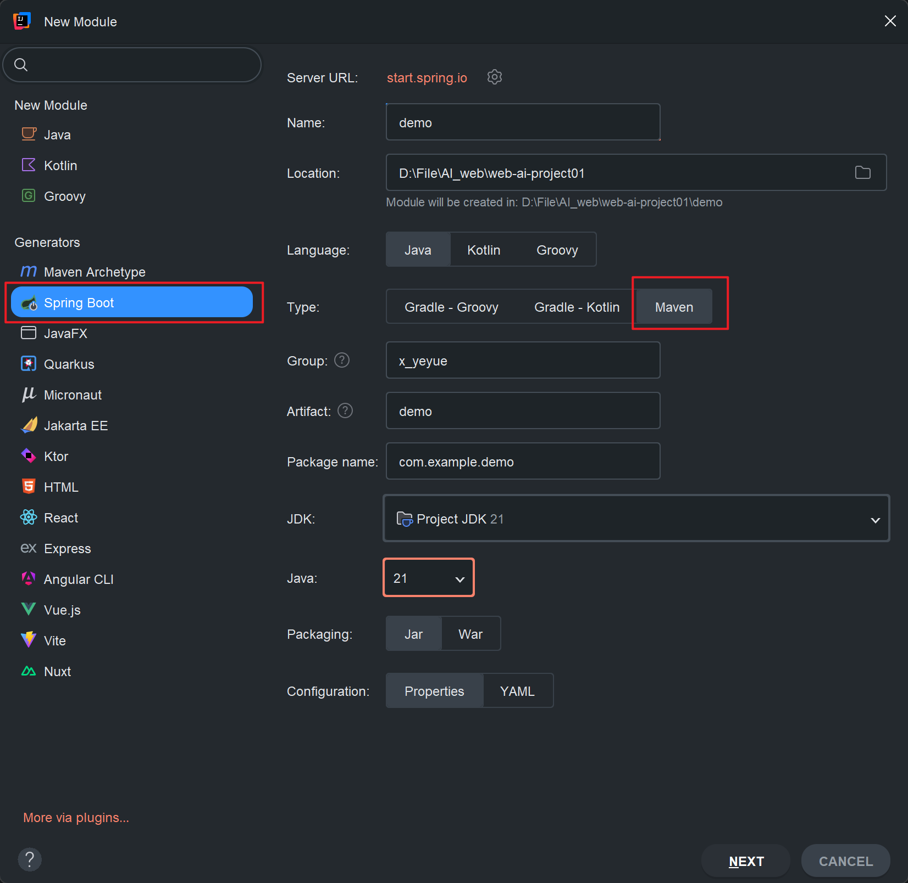
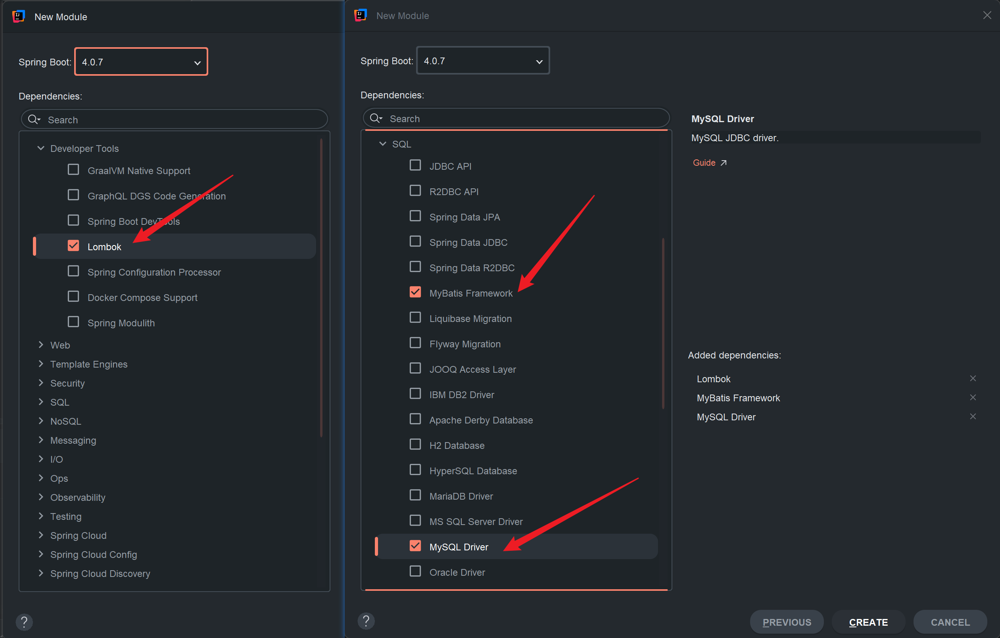

# 快速入门

**准备工作**:
1. 创建 SpringBoot 工程、引入 Mybatis 相关依赖
2. 准备数据库表 user、实体类 User
3.  配置 Mybatis(在 application.properties 中的数据库连接信息)

**编写 Mybatis 程序**: 编写 Mybatis 的持久层接口，定义 SQL(注解/XML)

引入依赖:





User 实体类 

```java
package x_yeyue.pojo;

import lombok.AllArgsConstructor;
import lombok.Data;
import lombok.NoArgsConstructor;

@Data
@AllArgsConstructor
@NoArgsConstructor
public class User {
    private Integer id;
    private String username;
    private String password;
    private String name;
    private Integer age;
}
```

编写 Mybatis 程序

```java
@Mapper // 应用程序运行时，会自动的为该接口创建一个实现类对象(代理对象)，并且会自动将该实现类对象存储 IOC 容器 - bean
public interface UserMapper {

    /**
     * 查询所有用户
     */
    @Select("select * from user")
    public List<User> selectAll();
}
```

## 辅助配置-配置 Mybatis 的日志输出

```properties
application.properties:

# mybatis 配置
# 日志输出
mybatis.configuration.log-impl=org.apache.ibatis.logging.stdout.StdOutImpl
```

## 切换数据库连接池

```xml
pom.xml:

<dependency>
	<groupId>com.alibaba</groupId>
	<artifactId>druid-spring-boot-starter</artifactId>
	<version>1.2.19</version>
</dependency>
```

```properties
application.properties:

spring.datasource.type=com.alibaba.druid.pool.DruidDataSource
spring.datasource.url=jdbc:mysql://localhost:3306/web01
spring.datasource.driver-class-name=com.mysql.cj.jdbc.Driver
spring.datasource.username=root
spring.datasource.password=123456
```

# 删除

```java
UserMapper:

@Delete("delete from user where id = #{id}")
public void deleteById(Integer id);
```

# 添加

```java
UserMapper:

@Insert("insert into user(username, password, name, age) values(#{username}, #{password}, #{name}, #{age})") // 调用的是 user 的对应属性
public void insert(User user);
```

# 更新

```java
UserMapper:

@Update("update user set username = #{username}, password = #{password}, name = #{name}, age = #{age} where id = #{id}")
public void update(User user);
```

# 查询

```java
UserMapper:

@Select("select * from user where username = #{username} and password = #{password}")
public User findByUsernameAndPassword(@Param("username") String username, @Param("Password") String password);
```

当有多个参数的时候，需要使用 `@Param` 注解为接口的方法起名字，SQL 语句中根据 `@Param` 注解起的名字获取对应参数。

**注**: 基于 *官方骨架创建的 springboot 项目* 中，接口编译时会保留方法形参，`@Param` 注解可以省略。