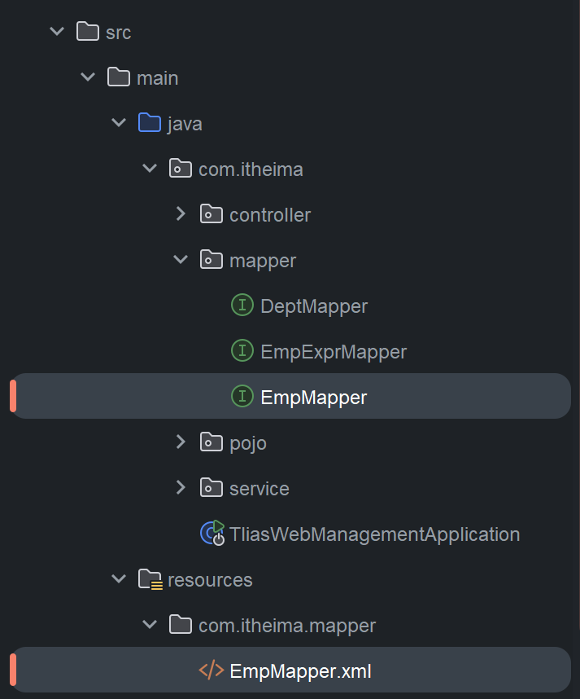
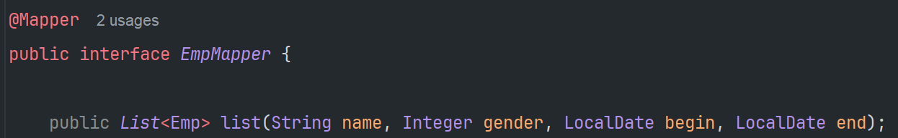
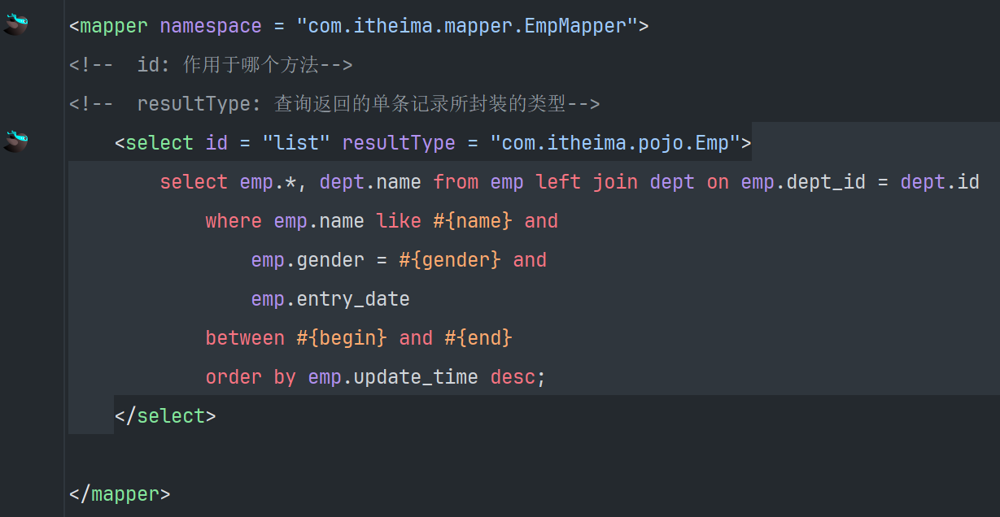
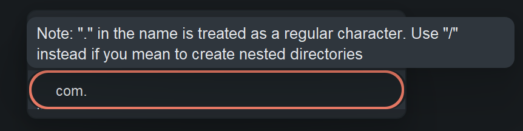
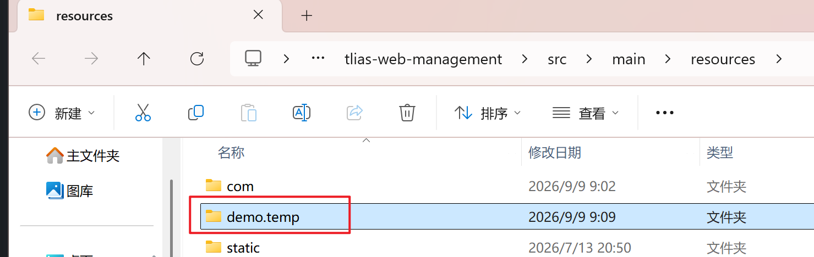
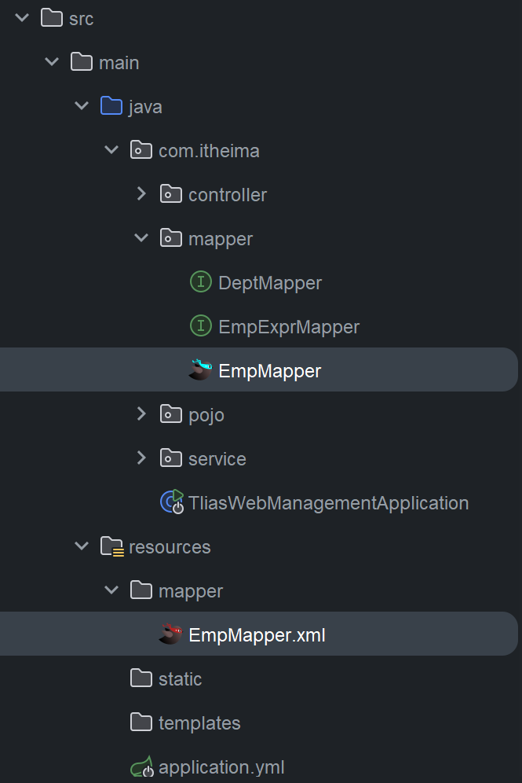

# 快速入门

**准备工作**:
1. 创建 SpringBoot 工程、引入 Mybatis 相关依赖
2. 准备数据库表 user、实体类 User
3.  配置 Mybatis(在 application.properties 中的数据库连接信息)

**编写 Mybatis 程序**: 编写 Mybatis 的持久层接口，定义 SQL(注解/XML)

引入依赖:


User 实体类 

```java
package x_yeyue.pojo;

import lombok.AllArgsConstructor;
import lombok.Data;
import lombok.NoArgsConstructor;

@Data
@AllArgsConstructor
@NoArgsConstructor
public class User {
    private Integer id;
    private String username;
    private String password;
    private String name;
    private Integer age;
}
```

编写 Mybatis 程序

```java
@Mapper // 应用程序运行时，会自动的为该接口创建一个实现类对象(代理对象)，并且会自动将该实现类对象存储 IOC 容器 - bean
public interface UserMapper {

    /**
     * 查询所有用户
     */
    @Select("select * from user")
    public List<User> selectAll();
}
```

## 辅助配置-配置 Mybatis 的日志输出

```properties
application.properties:

# mybatis 配置
# 日志输出
mybatis.configuration.log-impl=org.apache.ibatis.logging.stdout.StdOutImpl
```

## 切换数据库连接池

```xml
pom.xml:

<dependency>
	<groupId>com.alibaba</groupId>
	<artifactId>druid-spring-boot-starter</artifactId>
	<version>1.2.19</version>
</dependency>
```

```properties
application.properties:

spring.datasource.type=com.alibaba.druid.pool.DruidDataSource
spring.datasource.url=jdbc:mysql://localhost:3306/web01
spring.datasource.driver-class-name=com.mysql.cj.jdbc.Driver
spring.datasource.username=root
spring.datasource.password=123456
```

# 基础操作

[MYSQL命令](../class/mysql/mysql_基础操作.md#$MYSQL$#命令)

## 删除

```java
UserMapper:

@Delete("delete from user where id = #{id}")
public void deleteById(Integer id);
```

## 添加

```java
UserMapper:

@Insert("insert into user(username, password, name, age) values(#{username}, #{password}, #{name}, #{age})") // 调用的是 user 的对应属性
public void insert(User user);
```

## 更新

```java
UserMapper:

@Update("update user set username = #{username}, password = #{password}, name = #{name}, age = #{age} where id = #{id}")
public void update(User user);
```

## 查询

```java
UserMapper:

@Select("select * from user where username = #{username} and password = #{password}")
public User findByUsernameAndPassword(@Param("username") String username, @Param("Password") String password);
```

当有多个参数的时候，需要使用 `@Param` 注解为接口的方法起名字，SQL 语句中根据 `@Param` 注解起的名字获取对应参数。

**注**: 基于 *官方骨架创建的 springboot 项目* 中，接口编译时会保留方法形参，`@Param` 注解可以省略。

# XML 映射配置(SQL)

在 Mybatis 中，既可以通过注解配置 SQL 语句，也可以通过 XML 配置文件配置 SQL 语句。

较为复杂的 SQL 语句推荐使用 XML 配置。

## 默认规则

1. XML 映射文件的名称与 Mapper 接口名称一致，并将 XML 映射文件和 Mapper 接口放置在相同包下(**同包同名**)。
   
2. XML 映射文件的 `namespace` 属性为 Mapper 接口全限定名一致。
3. XML 映射文件中 sql 语句的 `id` 与 Mapper 接口中的方法名一致，并保持返回类型一致。
   




**注:** 在创建 *目录* 的时候，若包含多层目录，各层级间要用 “/” 分隔，而不是 “.”。




如果使用 “.” 分隔，在资源管理器中显示的文件夹就不会出现层级关系，如图:



## 参考配置

[MyBatis 入门](https://mybatis.org/mybatis-3/zh_CN/getting-started.html#入门)

```xml
<?xml version="1.0" encoding="UTF-8" ?>
<!DOCTYPE mapper
  PUBLIC "-//mybatis.org//DTD Mapper 3.0//EN"
  "https://mybatis.org/dtd/mybatis-3-mapper.dtd">

<mapper namespace="org.mybatis.example.BlogMapper">
  <select id="selectBlog" resultType="Blog">
    select * from Blog where id = #{id}
  </select>
</mapper>
```

## 辅助配置

### 更改 XML 映射配置文件的位置

```properties
application.properties:

# 指定 XML 映射配置文件的位置
mybatis.mapper-locations=classpath:mapper/*.xml
```

修改前:


修改后:



# 动态 SQL

随着用户的输入或外部条件的变化而变化的 SQL 语句，我们称为 **动态SQL**。

## if

`<if>` 判断条件是否成立，如果条件为 true，则拼接 SQL。

```xml
<select id = "list" resultType = "com.itheima.pojo.Emp">
	select * from emp as e 
	where 
		<if test = "gender != null">
			e.gender = #{gender}
		</if>
</select>
```

## where

`<where>` 根据查询条件，来生成 `where` 关键词，并会自动去除条件前面多余的 `and` 或 `or`。

```xml
<select id = "list" resultType = "com.itheima.pojo.Emp">
	select * from emp as e 
		<where>
			<if test = "name != null and name != ''">
				e.name like concat('%', #{name}, '%') 
			</if>
			<if test = "gender != null">
				and e.gender = #{gender}
			</if>
		</where>
		order by e.update_time desc
</select>
```

**注:** `<where>` 标签仅会去除多余的 `and` 或 `or` 并不能添加缺失的 `and` 或 `or`，且仅对前端起效。