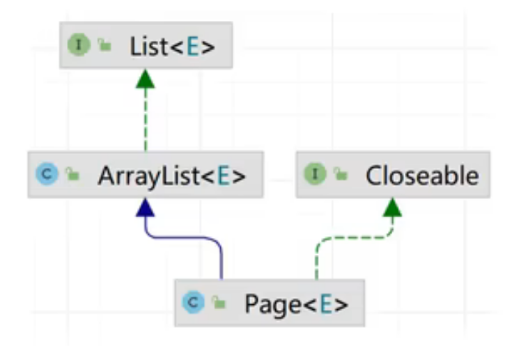
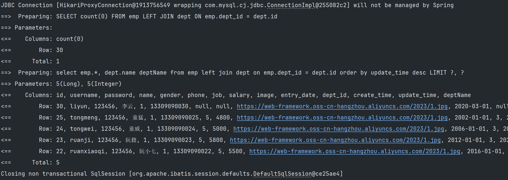
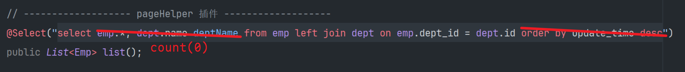
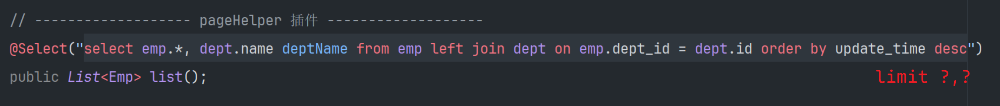
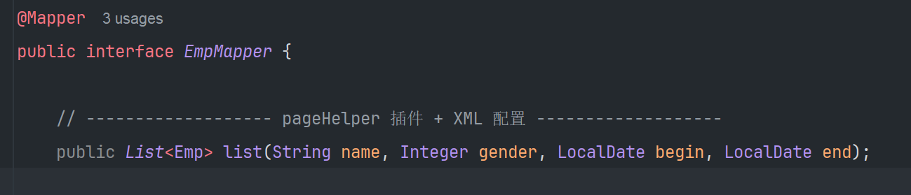
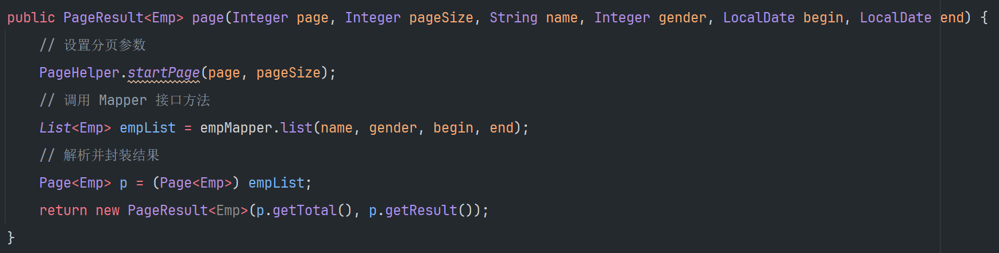

PageHelper 是第三方的在 Mybatis 框架中用来实现分页的插件，用来 *简化分页操作*，*提高开发效率*。

# 使用步骤

1. 引入 PageHelper 的依赖
   ```xml
   <dependency>
		<groupId>com.github.pagehelper</groupId>
		<artifactId>pagehelper-spring-boot-starter</artifactId>
		<version>1.4.7</version>
	</dependency>
   ```
2. 定义 Mapper 接口的查询方法(无需考虑分页)
   ```java
	@Select("select emp.*, dept.name deptName from emp left join dept on emp.dept_id = dept.id order by update_time desc")
	public List<Emp> list();
   ```
3. 在 Service 方法中时讯分页查询
   ```java
    @Override
    public PageResult<Emp> page(Integer page, Integer pageSize) {
        // 设置分页参数
        PageHelper.startPage(page, pageSize);
        // 调用 Mapper 接口方法
        List<Emp> empList = empMapper.list();
        // 解析并封装结果
        Page<Emp> p = (Page<Emp>) empList; // 强转为 Page 类型
        return new PageResult<Emp>(p.getTotal(), p.getResult());
    }
   ```
   


`Page` 是 `ArrayList` 的子类，同时 `ArrayList` 实现了 `List<E>`，所以 `Page` 就是 `List` 的实现类。([[多态]])

`Page` 中实现了很多的方法，将 `List` 强转为 `Page`，可以通过 `Page` 实现的方法快速实现需求。

# PageHelper 的实现机制

调用数据库时的日志:



实现时的代码:

```java
// 查询员工数据
@Select("select emp.*, dept.name deptName from emp left join dept on emp.dept_id = dept.id order by update_time desc")
public List<Emp> list();
```

显然并没有实现具体的分页查询，仅仅实现了查询员工数据功能。

PageHelper 会在执行 sql 前拦截 sql 语句，并对其进行改造。

- 移除查询的各元素并替换为 `count(0)`，并移除 `order by` 的排序(提高性能)，查询查询数据条数。



- 在原 sql 语句后添加 `limit ?, ?` 实现分页查询。



# 注意事项

1. sql 语句最后不能添加分号 “;”。
   不使用 PageHelper 时可以添加分号。
   由于在使用 PageHelper 时会在 sql 语句最后追加 `limit ?,?`，如果添加了分号就会出现 `select ... from ... ; limit ?,?`，会爆出 SQL 语法错误 `SQLSyntaxErrorException`。
2. PageHelper 仅仅能对紧跟在其后的第一个查询语句进行分页处理。
   ```java
   @Override
    public PageResult<Emp> page(Integer page, Integer pageSize) {
        // 设置分页参数
        PageHelper.startPage(page, pageSize);
        // 调用 Mapper 接口方法
        List<Emp> empList = empMapper.list();
        
        List<Emp> empList2 = empMapper.list();  // PageHelper 不会对该条查询进行分页处理
        
        // 解析并封装结果
        Page<Emp> p = (Page<Emp>) empList; // 强转为 Page 类型
        return new PageResult<Emp>(p.getTotal(), p.getResult());
    }
   ```

# 多参数查询

当除去 *分页查询* 外还需要传递其余的参数时如图:





