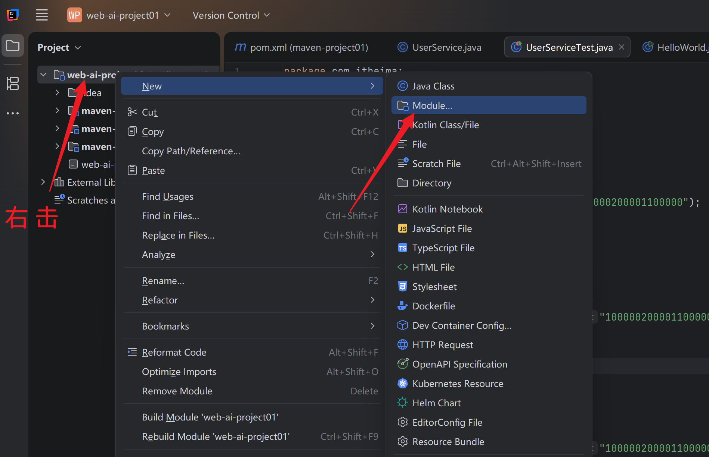
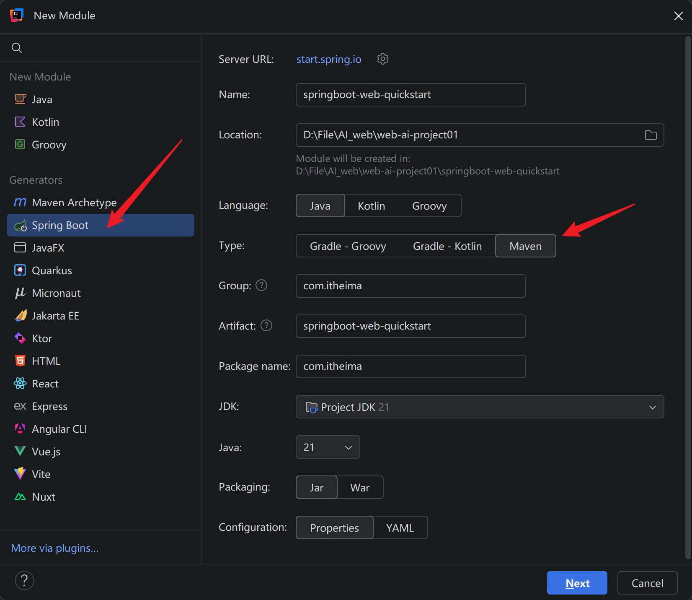
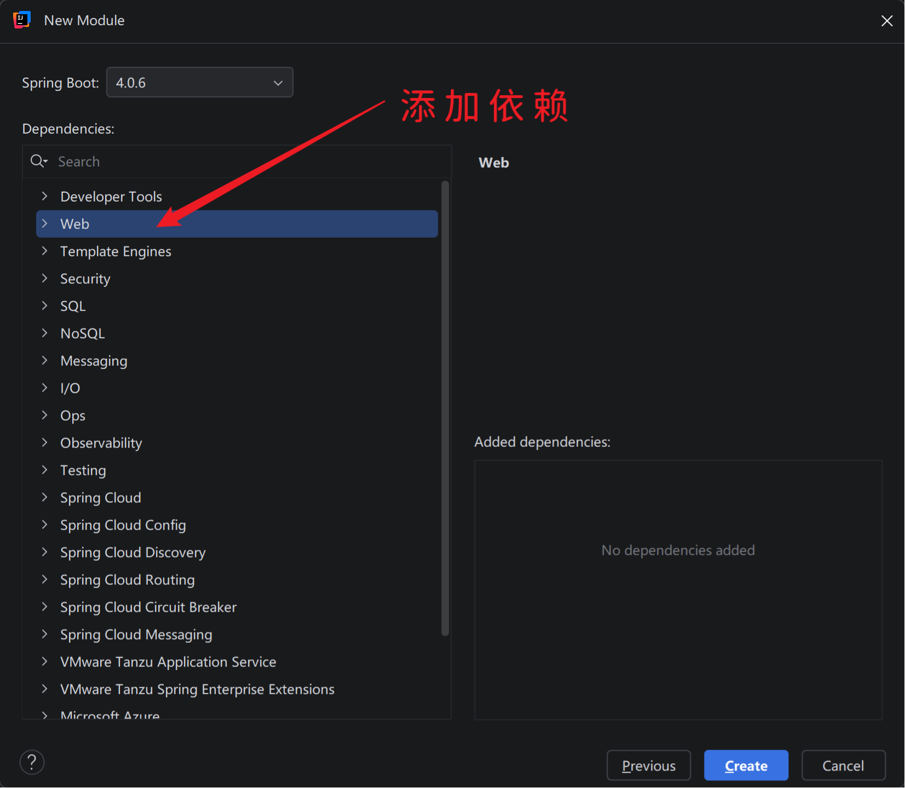
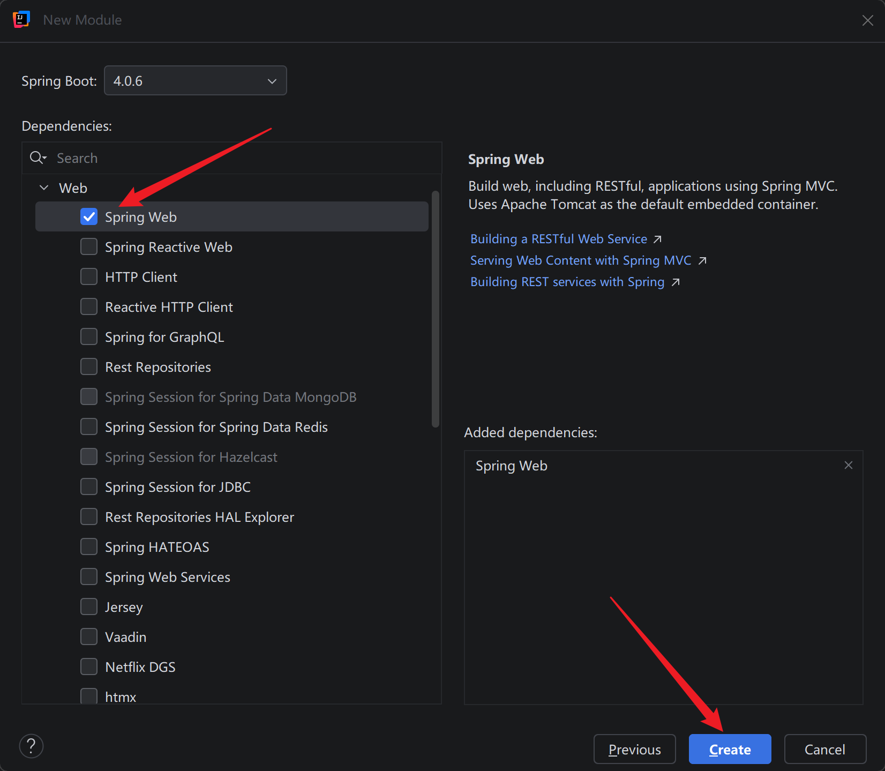
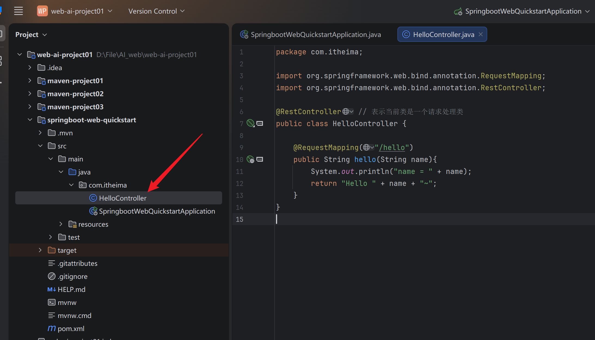
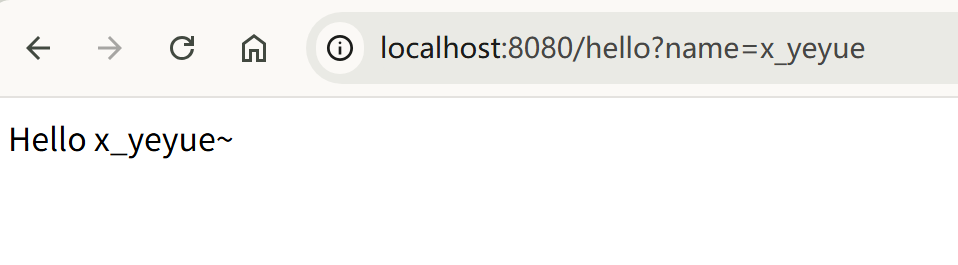

## 导入 SpringBoot 模块

## 基础例子

**需求:**

浏览器向服务器的 `hello` 地址发起请求，服务器获取请求中的 `name` 值并按照图中格式输出，并返回给浏览器。

**实现:**

在如图目录中创建 `HelloController` 类文件，并实现如图代码。

在 `SpringbootWebQuickstartApplication` 中运行后，实现该效果。如图:

