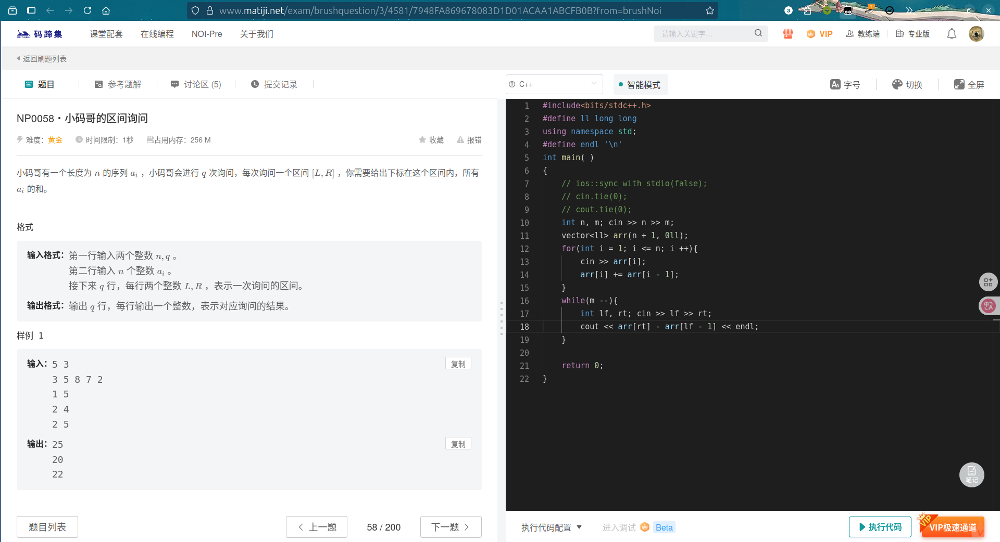
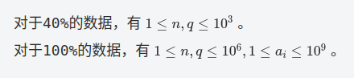
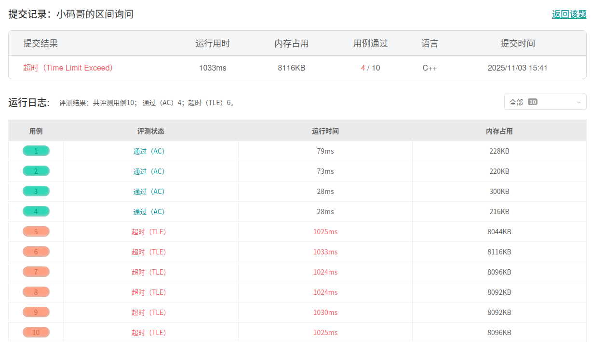
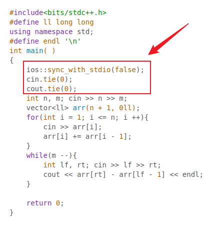

# 复杂度分析与STL选讲+数据结构

## 时间复杂度

### 选择排序

给一个长度为 $n$ 的数组 $arr$, 对该数组进行递增排序。
$$
\begin{split}
    0, 1, 2 \cdots n - 1 \; &\to n \\
    1, 2 \cdots n - 1 \; &\to n - 1 \\
    2, \cdots n - 1 \; &\to n - 2 \\
    \cdots & \cdots \\
    n - 1 \; &\to 1
\end{split}
$$

56
$56$

总计算次数 $= n + (n - 1) + (n - 2) + \cdots + 1$
等差数列求和公式： $S_n = \frac{\left(a_1 + a_n\right)n}{2} = a_{1}n + \frac{n \left(n - 1\right)d}{2}$

原式 $= \frac{\left(1 + n\right)n}{2} = \frac{1}{2}n^{2} + \frac{1}{2}n$

**$O\left(\frac{1}{2}n^{2} + \frac{1}{2}n\right) \to O(n^{2})$**
排除常数和低阶项，大致是什么规模的。

> **常数操作：** 固定时间的操作，执行时间和数据量无关。例如：位运算、算数运算、寻址、哈希等等。$O(1)$

为什么排除常数和低阶项？
对比 $100000n$ 和 $n^{2}$ 在 $n$ 不断增加的后，两个式子的大小变化。（低阶项也同理）

### 线性查找

给定一个长度为 $n$ 的数组 $arr$，查找该数组中是否存在数 $num$。
$arr = \left[3, 9, 5, 5, 7, 2\right], num = 2$
从左往右，依次查找，需要 $n$ 次。
那如果说 $num = 3$ 或者 $num = 6$, 需要几次？
$1$ 次，$n$ 次。
这里的时间复杂度为 **$O(n)$**，线性的。
只考虑最坏的情况。

## 空间复杂度

> 为了完成一个功能，不得不申请的空间的大小。

上面的两个都是 $O(n)$ 的空间复杂度。

## 时间复杂度的均摊

> **固定数组:** 空间大小固定的数组。
> **动态数组:** 空间大小不固定，会动态变化的数组。

有一个动态数组 $arr$，我们要向该数组中添加 $n$ 个数。
假设该动态数组最初大小为 $0$，数组大小不足则扩容，扩容规则为容量翻倍。
注：$\left(0 \to 1\right)$，忽略系统开辟空间的时间。（*实际的扩容规则并非如此*）

第一次操作时，系统准备了空间为 $1$ 的数组，我们将数据放入数组。
$arr[\;] = \{a\}$
第二次操作时，系统准备了空间为 $2$ 的数组，我们将数据让如数组。
$arr[\;] = \{a, b\}$
第三次操作时，系统准备了空间为 $4$ 的数组，我们将数据放入数组。
$arr[\;] = \{a, b, c, ?\}$
$\cdots \; \cdots$

假设需要添加 $16$ 个数：
代价 : $1 + 2 + 4 + 8 + 16 \lt 2 \times 16$
添加 $32$ 个数呢？
代价 : $1 + 2 + 4 + 8 + 16 + 32 \lt 2 \times 32$
添加 $n$ 个数?
代价 $\lt 2n \to$ **时间复杂度** **$O\left(2n\right) \to O(n)$**

*均摊*给每次添加，那么每次添加的时间复杂度是多少？
**$O\left(\frac{n}{n}\right) \to O(1)$**

### 为什么需要 均摊 的概念呢？

> 简化时间复杂度的估算。

在一个具体的程序中，会用到很多的数据结构(并查集、单调队列、单调栈、哈希表等等)，我们难道每个操作的时间复杂度都具体估算吗？并不会，我们可以通过 *均摊* 将其每次的操作，简单的估算为 $O(1)$ 来方便计算。

## 不要简单的用代码的结构来判断时间复杂度


冒泡排序
```c++
void solve(void){
    vector<int> arr = {6, 7, 3, 12, 91, 55};
    int n = arr.size();
    // 递增排序
    for(int i = n - 1; i > 0; i --){
        for(int j = 1; j <= i; j ++){
            if(arr[j - 1] > arr[j]) swap(arr[j - 1], arr[j]);
        }
    }
    for(int i = 0; i < n; i ++){
        if(i > 0) cout << " ";
        cout << arr[i];
    }cout << endl;
}
/*
>>> 3 6 7 12 55 91
*/
```

`arr`

```c++

```


### 例一
```c++
void solve(void){
    vector<int> arr = {6, 7, 3, 12, 91, 55};
    int n = arr.size();
    // 递增排序
    int end = n - 1, j = 1;
    while(end > 0){
        if(j > end){
            end --;
            j = 1;
            continue;
        }
        if(arr[j - 1] > arr[j]) swap(arr[j - 1], arr[j]);
        j ++;
    }
    for(int i = 0; i < n; i ++){
        if(i > 0) cout << " ";
        cout << arr[i];
    }cout << endl;
}
/*
>>> 3 6 7 12 55 91
*/
```
时间复杂度分别是多少呢?

### 例二
```c++
void solve(void){
    int n = 10;
    for(int i = 1; i <= n; i ++){
        for(int j = i; j <= n; j += i){
            // pass
        }
    }
}
```
这个的时间复杂度是多少？
$i = 1 : \frac{n}{1}$
$i = 2 : \frac{n}{2}$
$i = 3 : \frac{n}{3}$
$\cdots \; \cdots$
$i = n : \frac{n}{n}$
$$
\begin{split}
    sum &= \frac{n}{1} + \frac{n}{2} + \frac{n}{3} + \cdots + \frac{n}{n}\\
    &= n \times \left(\frac{1}{1} + \frac{1}{2} + \frac{1}{3} + \cdots + \frac{1}{n}\right)\\
    &= nlog_{2}n
\end{split}
$$

时间复杂度: **$O\left(nlog_{2}n\right) \to O\left(nlogn\right)$**

> **调和级数**： $\frac{1}{1} + \frac{1}{2} + \frac{1}{3} + \cdots + \frac{1}{n} \to $ **$log_{2}n$**

## 常见的复杂度一览

> 时间复杂度非常重要，可以直接判断某个方法能不能通过一个题目。
> **根据数据量*猜*解法**。

$O(1),\; O(logn),\; O(\sqrt{n}),\; O(n),\; O(nlogn),\; O(n^{2}), \cdots, O(n^{k}),\; O(2^{n}), \cdots , O(n!)$ 等

| 数据范围$(n)$ | 推荐时间复杂度 | 最大可处理数据量(估算) |
| :---------: | :----------: | :---------------: |
| $n \le 10$ | $O\left(n!\right)$ | $12\left(12! \approx 4.7e8\right)$ |
| $n \le 20$ | $O\left(2^{n}\right)$ | $20\left(2^{20} \approx 1e6\right)$ |
| $n \le 100$ | $O\left(n^{3}\right)$ | $100\left(100^{3} = 1e6\right)$ |
| $n \le 1000$ | $O\left(n^{2}\right)$ | $1000\left(1e6\right)$ |
| $n \le 1e5$ | $O\left(nlogn\right)$ | $1e5\left(1e5 \times 17 \approx 1.7e6\right)$ |
| $n \le 1e6$ | $O\left(nlogn\right)$ | $1e6\left(1e5 \times 20 \approx 2e7\right)$ |
| $n \le 1e7$ | $O\left(n\right)$ | $1e7\left(1e7\right)$ |
| $n \le 1e8$ | $O\left(1\right)$ 或 $O(logn)$ |  |

## c++ 的 $I/O$

c++中使用 $cin$ 和 $cout$ 输入输出的效率是很慢的。

[例子](https://www.matiji.net/exam/brushquestion/3/4581/7948FA869678083D1D01ACAA1ABCFB0B?from=brushNoi)








```c++
// 关闭 cin/cout 与 C 语言 stdio（如 scanf/printf）的同步机制，消除冗余开销。
ios::sync_with_stdio(false);
// 解除 cin 与 cout 的绑定关系，避免 cin 每次读取前自动刷新 cout 缓冲区
cin.tie(0);
// 解除 cout 与其他输出流的默认绑定（配合上一行，进一步减少刷新开销）
cout.tie(0);
```

## $STL$选讲

### map

> **问题：** 我们需要记录学校中一些学生的成绩。
> **存储格式：** \{学号:分数\}
> **注：** 不细究哪门科目，假设学号的类型为 $int$,分数类型为 $int$。

1 : 65
2 : 84
3 : 94
4 : 56

怎么存储

1 : 65
20000000 : 84
3 : 94
400000000 : 56

#### 操作 map

`map<type, type> new_name`
```c++
void solve(void){
    // 创建
    map<int, int> source;
    // 添加
    source[1] = 65;
    source[20000000] = 84;
    source[3] = 94;
    source[400000000] = 56;

    // 删除
    source.erase(3);

    // 查询
    cout << source[1] << endl;

    // 如果查询没有存储的元素会如何？ 查询之后，原来的 map 中的元素会变化吗？
    cout << source[2] << endl;

    // 获取 map 的大小
    cout << source.size() << endl;

    // 遍历
    for(auto it : source){
        // cout << it << endl; // ？？？
        // cout << it.first << ":" << it.second << endl;
    }
    for(auto [id, val] : source){
        // cout << id << ":" << val << endl; // ？？？
    }
    for(auto it = source.begin(); it != source.end(); it ++){
        // cout << it.first << ":" << it.second << endl; // ？？？
        // cout << it->first << ":" << it->second << endl;
    }
}
/*
>>> 65
>>> 0
*/
```


通过代码的运行我们发现了什么？

如果类型改为 `<string, int>` 类型应该如何操作？

#### map 的效率

> $map$ 基于 **红黑树** (**平衡二叉搜索树**)。
> $map$ 的插入与查询效率固定为 **$O(logn)$** 。

### unordered_map

操作同 $map$。
通过调试观察其特性.

#### unordered_map 效率

> 基于 **哈希(hash)**。
> 时间复杂度 **$O(1 \sim n)$**。

### set

> 如果我们要记录学校的某个班级里是否包含某个人该如何做呢？

#### 操作

```c++
void solve(void){
    // 创建
    set<string> name;
    // 添加
    name.insert("张三");
    name.emplace("张三");
    // 删除
    name.erase("张三");
    name.erase("李四");
    // 查询
    if(name.count("张三")){
        cout << "Yes" << endl;
    }else{
        cout << "No" << endl;
    }
    if(name.find("张三") != name.end()){
        cout << "Yes" << endl;
    }else{
        cout << "No" << endl;
    }

    // 获取大小
    cout << name.size() << endl;
    
    // 遍历
    for(auto it : name){
        // cout << it << endl; // ？？？
        // cout << it.first << ":" << it.second << endl;
    }
    for(auto it = name.begin(); it != name.end(); it ++){
        // cout << it << endl; // ？？？
        cout << *it << endl;
    }
}
```

#### 效率

> 基于 **红黑树** 。
> 时间复杂度固定为 **$O(logn)$**

### unordered_set

操作同 $set$。

#### 效率

> 基于 **哈希(hash)**。
> 时间复杂度 **$O(1 \sim n)$**。

### lower_bound 和 upper_bound 函数

> 二分函数，快速的实现简单的二分。

`lower_bound` : 返回第一个**大于等于**目标值的迭代器。
`upper_bound` : 返回第一个**大于**目标值的迭代器。

```c++
void solve(void){
    vector<int> arr = {2, 8, 16, 32, 45, 65};
    auto it = lower_bound(arr.begin(), arr.end(), 32);
    cout << *it << endl;

    int inx = lower_bound(arr.begin(), arr.end(), 32) - arr.begin();
    cout << "index : " << inx << "    val : " << arr[inx] << endl;

    cout << endl;
    
    int inx2 = upper_bound(arr.begin(), arr.end(), 32) - arr.begin();
    cout << "index : " << inx2 << "    val : " << arr[inx2] << endl;
}
```

对 `set` 进行二分查找

```c++
void solve(void){
    vector<int> arr = {2, 8, 16, 32, 45, 65, 8, 65, 45};
    set<int> st(arr.begin(), arr.end());

    auto it = st.lower_bound(8);
    cout << *it << endl;

    // int inx = st.lower_bound(8) - st.begin(); // ？？？ 

    auto it2 = st.upper_bound(8);
    cout << *it2 << endl;
}
```

对 `map` 进行二分查找。

```c++
void solve(void){
    map<int, int> mp;
    mp[3] = 6;
    mp[6] = 12;
    mp[9] = 18;
    mp[12] = 24;

    auto it = mp.lower_bound(6);
    // cout << it.first << " " << it.second << endl; // ？？？
    cout << it->first << " " << it->second << endl;

    auto it = mp.upper_bound(6);
    // ？？？
}
```

### priority_queue

> **堆结构**，基于 **完全二叉树**。
> **堆的特性:** 顶部的优先级大于底部的优先级。
> 完全二叉树，
> 时间复杂度 **$O(logn)$**。

#### 操作 priority_queue

简单版
```c++
void solve(void){
    // 创建
    priority_queue<int> pq;
    // 添加
    pq.push(3);
    pq.emplace(3);
    pq.emplace(1);
    pq.emplace(5);
    // 删
    pq.pop();
    // 查
    cout << pq.top() << endl;
    cout << pq.size() << endl;
    if(pq.empty()){
        cout << "None" << endl;
    }else{
        cout << "have" << endl;
    }
}
```

#### 参数
`priority_queue<type, Container, Compare> name`
- `type` : 元素的类型。
- `Container` : 低层容器，默认 `vector` 。
- `Compare` : 优先级比较函数.(默认为 `less<type>`,大根堆)

升级版

```c++
void solve(void){
    // 创建
    priority_queue<int, vector<int>, greater<int> > pq;
    // 添加
    pq.push(3);
    pq.emplace(3);
    pq.emplace(1);
    pq.emplace(5);
    // 删
    pq.pop();
    // 查
    cout << pq.top() << endl;
    cout << pq.size() << endl;
    if(pq.empty()){
        cout << "None" << endl;
    }else{
        cout << "have" << endl;
    }
}
```

超进化
```c++
/*
首先根据时间的优先级来排序，时间越早，优先级越高。
若时间相同，则按照 op 的优先级排序。

op
1 : 吃
2 : 喝
3 : 睡
数字越小的，优先级越高
*/

struct node{
    int time;
    int op;
    node() = default;
    node():time(-1), op(0){}
    node(int _time, int _op):time(_time), op(_op){}
    bool operator<(const node &nxt)const{
        if(time == nxt.time){
            return op > nxt.op;
        }
        return time > nxt.time;
    }
};

void solve(void){
    // 创建
    priority_queue<node, vector<node>> pq;
    // 添加
    pq.push(node(3, 2));
    pq.emplace(4, 1);
    pq.emplace(node(5, 3));
    pq.emplace(node(3, 1));
    // 删
    pq.pop();
    // 查
    // cout << pq.top() << endl; // ？？？
    // cout << pq.top().time << " " << pq.top().op << endl;
    cout << pq.size() << endl;
    if(pq.empty()){
        cout << "None" << endl;
    }else{
        cout << "have" << endl;
    }
}
```

## 数据结构

### 链表

链表的每个节点一般包含两个属性：\{值，下一个节点的地址\}
- 分散在内存的不同位置。
- 不能随机访问。
- 长度动态改变

#### 分类

单向链表、双向链表、循环链表。
- **单向链表** : 节点的指针仅指向下一个节点
- **双向链表** : 节点的指针指向下一个节点和上一个节点
- **循环链表** : 尾部节点指向首节点(双/单向)。

#### 时间复杂度

| 操作 | 单链表 | 双向链表 |
| :----: | :----: | :----: |
| 表头插入/删除 | $O(1)$ | $O(1)$ |
| 表尾插入/删除 | $O(n)$ | $O(1)$ |
| 中间插入/删除(已知节点) | $O(1)$ | $O(1)$ |/BFS）
| 查找指定元素 | $O(n)$ | O(n) |

### 树

#### 属性

- **根节点**：树的最顶层节点(无父节点)。
- **叶子节点**：无子节点的节点(树的最底层)。
- **父/子节点**：与该节点连接的上下层节点。
- **兄弟节点**：同一父节点的子节点。
- **深度**：根节点到当前节点的边数。
- **节点的度**：节点的子节点个数。
- **树的高度**：树的最大深度。

#### 常见的类型

- **二叉树**
- **二叉搜索树(BST)**
- **平衡二叉树(如红黑树)**
- **多叉树**
- **堆**

### 常见的几种遍历方式

- **前序遍历**
- **中序遍历**
- **后序遍历**

---

### 图

#### 属性

- **顶点(节点):** 图中的元素(如人、城市等)。
- **边:** 连接两个顶点的关系(如人与人间的朋友关系、城市间的道路)。
- **权重:** 边的附加信息(如道路的长度、通信成本等)。
- **度:** 顶点连接的边数(有向图分*入度*和*出度*)。
  - **入度:** 指向该顶点的边数。
  - **出度:** 从该节点出发的边数。
  
#### 分类

- 按边的方向
  - 有向图
  - 无向图
- 按边的权重
  - 无权图
  - 加权图
- 按连通图
  - 连通图：任意两顶点间都有间接路径
  - 强连通图：任意两顶点间都有直接路径
- 按结构特性
  - 稀疏图
  - 稠密图
- 特殊类型——无环图

#### 图的表示

- **邻接矩阵**
- **邻接表**
- **链式前向星**